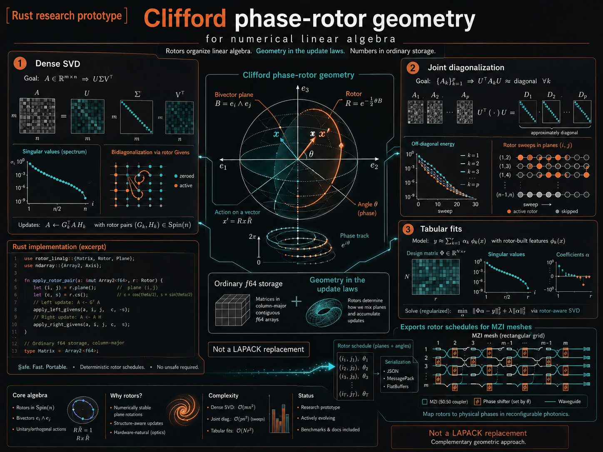

# lie_cliffalg_analog_svd
## TL;DR

Rust research prototype for dense numerical linear algebra, organized around one
idea: rows and columns are two families of generators, and a decomposition is a
schedule of rotations that locks their relative phases.

Storage stays ordinary — `f64` arrays in CPU memory, `Complex64` on the complex
branch. The geometry lives in the update rules, not in the memory layout, which
is what makes the same rotor stream exportable to analog or photonic meshes
where orthogonal rotations are native operations.

## What's in it

- **SVD** for square and rectangular dense matrices: an exact polar/Jacobi
  baseline, closed-form kernels for `n <= 4`, an active phase-locking route with
  golden-angle anti-resonance, and a conservative dispatcher that only enables
  the geometric routes when a cheap `O(n^2)` triage supports them.
- **Joint diagonalization** of matrix families — same-size (Phase-JADE),
  two-sided, and across *heterogeneous* axis sets, where matrices share only
  some of their generators.
- **Adjacent problems on the same machinery**: blind source separation,
  three-mode HO-SVD, and tabular fits (Gram, dual/kernel, anisotropic ridge,
  Procrustes transfer).
- **Hardware export**: any accepted rotor stream, or any orthogonal matrix,
  compiles to a layer/channel/angle schedule for a Mach–Zehnder mesh.

## What it's for

Difficult inputs. Degenerate spectra, extreme ill-conditioning, non-normal and
Jordan-like structure, and cases where a small reconstruction error hides a
broken singular-vector basis — which is why the package reports orthogonality
and spectrum-tail diagnostics, not only `||A - U Sigma Vt||`.

## What it is not

Not a LAPACK replacement, and not universally faster than classical dense
solvers. Results here are reproducible smoke checks on synthetic profiles, not
wall-clock benchmarks against production solvers.

## Reporting practice

Claims in this repository are tests. Routes that failed are reported with the
numbers, and where the cause was later found the fix is recorded alongside the
original failure rather than replacing it — comparison tests are written to
assert the comparison, not a threshold, so a reversal announces itself.

Two preprints describe the method and its measured limits: Part I (operators)
and Part II (tables and heterogeneous coupling). DOIs below.

<p align="center">
  
</p>

---

## What We Built

This release is the result of a sequence of geometry-inspired SVD experiments
that were gradually made more conservative and testable:

- **Robust baseline:** `LieSvdSmall` uses polar decomposition plus symmetric
  Jacobi polish, avoiding `A^T A` as the primary route so the condition number
  is not squared up front.
- **Tiny rotor kernels:** `LieSvdMicro` handles `N <= 4` as local rotor cells,
  with residual checks and fallback to the robust baseline.
- **Block-4 macro rotors:** `LieSvdBlock4` promotes the `4x4` cell into a
  larger warm-start primitive, using contiguous quartets and power-of-two
  butterfly quartets before a final digital polish.
- **Analog/photonic schedule:** `LieSvdAnalog` models SVD as conflict-free
  layers of `2x2` rotation cells, then finishes with digital polish.
- **Core-flow state:** `LieSvdCoreFlow` exposes `core = U^T A V`, keeps `A`
  fixed, and moves only the two orthogonal bases.
- **Repellers:** optional Calogero-Moser-style anti-clustering terms act during
  degenerate/off-diagonal phases, then stay out of final polish.
- **Kernel route:** `kernel_gram` separates symmetric single-domain Gram/RBF
  kernels (`K = U Sigma U^T`) from nonsymmetric bipartite kernels.
- **Topological warm-start:** `lie_svd_topowarm` uses stationary masses,
  Fiedler-like graph relaxation, phase-stress landmarks, pseudo-random probes,
  and orthogonal retraction to seed `CoreFlow` and `Block4`.
- **Adaptive synergy:** `LieSvdAdaptive` decides when the full geometric stack
  is worth using and otherwise preserves the `Small` fast path.
- **Tensor/Kronecker view:** `lie_svd_tensortrain` detects matrices that are
  close to chains of `2x2` Kronecker factors and, when that structure is real,
  assembles the SVD from tiny local rotor SVDs.
- **Trace/Procrustes navigator:** `lie_svd_traceflow` starts from identity
  bases and rotates them like an inverse Rubik path, maximizing
  `sum(abs(diag(U^T A V)))` before digital polish.
- **Global quad-view audit:** `lie_svd_quadenergy` treats rows and columns as
  separate Clifford basis families (`e_i`, `f_j`) and measures the primal
  row-column tensor, row-dual metric, column-dual metric, and full dual
  mismatch.
- **Fractal phase-health audit:** `lie_svd_phasehealth` treats every row and
  every column as its own local Clifford-like signal and reports scalar mass,
  vector spread, deterministic phase-delay twist, entropy, and row/column
  disagreement.
- **Active phase-flow solver:** `lie_svd_phaseflow` turns that phase portrait
  into an actuator. It applies global phase-jump rotors and targeted unwrap
  rotors as a first-class SVD route, with golden-angle anti-resonance jumps and
  a guarded `4x4` surgery fallback for high-stress plateaus. `0.19.0` adds a
  Layer-0 **Golden Global Phase Dispersion** sheet: all row/column axes receive
  a deterministic Fibonacci/golden pre-spin through real conflict-free rotors
  before the local `4x4` and `2x2` phase cells begin. `0.23.0` adds the
  causal/Jordan antipode: a **Causal Anti-Spin** layer with opposite-sign
  row/column rotors for one-sided triangular flow. `0.24.0` adds the
  **Cross-Phase Yin-Yang Cycle**: a multi-layer four-act row/column
  golden-antipode cascade with golden-ratio annealing. `0.25.0` adds
  **Phase-Conjugate Auto-Spin** and **Bottleneck Phase Alignment**, so the
  solver can mirror the phase state it sees and attack maximum-energy pairs
  first.
- **Phase passport dispatch:** `PhaseSignature` compresses the row/column
  phase field into mean stress, max twist, causal disbalance, and entropy gap.
  `LieSvdAdaptive` now uses this passport to route degenerate and causal/Jordan
  stress through `PhaseFlow` up to the current geometric auto cap (`N <= 64`
  by default). Larger matrices can still run `PhaseFlow`/`CoreFlow` explicitly
  from `stress_cpu` while the batch/cache kernel is developed.
- **Phase-JADE joint diagonalization:** `lie_svd_joint` applies the same shared
  rotor logic to matrix families, minimizing
  `sum_k ||offdiag(V^T M_k V)||^2` with in-place joint pair updates.
- **Phase-BSS:** `lie_svd_bss` uses whitening plus lagged-covariance
  Phase-JADE to separate mixed channels and report channel phase coherence.
- **Tensor phase factorization:** `lie_svd_tensor` adds a first 3D HO-SVD /
  Tucker-style route, rotating each tensor mode into an orthogonal core.
- **Complex-native phase engine:** `lie_svd_complex` starts the `Complex64`
  branch. It supports complex SVD, direct U(1) golden pre-spin, a `2x2`
  complex microkernel, Hermitian Jacobi phase alignment, and MZI-native phase
  event export.
- **Unified phase engine:** `lie_svd_engine` adds `PhaseEngine` and
  `PhasePassport`, giving real SVD, complex SVD, Phase-BSS, tensor HO-SVD, and
  Phase-JADE a shared diagnostic/report interface.
- **Hardware schedule compiler:** `lie_svd_compiler` converts real and complex
  phase events into a unified MZI/FPGA-style schedule with layers, channels,
  phase angles, and JSON export.
- **Two-sided Joint SVD:** `LieSvdJoint::joint_svd` extends the ensemble route
  to nonsymmetric families `U^T A_k V`; square families now have a tested
  two-sided phase-locking path.
- **Rectangular phase diagnostics:** `LieSvdPhaseFlow` now has a rectangular
  phase-locking route for `N x M` operators. Row generators `e_i` and column
  generators `f_j` are treated as different spaces, with full rectangular
  output shapes `U: N x N`, `sigma: min(N,M)`, and `Vt: M x M`.
- **Exact axis-energy pruning:** `0.26.0` adds `hot_axes`, a certificate-based
  pre-filter used by every pair-candidate builder in `PhaseFlow`:
  `pair_offdiag(i,j) <= min(axis_energy_i, axis_energy_j)` where
  `axis_energy_k = row_norm_k + col_norm_k`, so any axis at or below `pair_tol`
  can be dropped from search without reading the matrix. It's an exact, free
  floor, not a demonstrated speedup on the current dense/random benchmark
  suite (those profiles don't have genuinely cold axes); `active_set_alpha`
  adds an opt-in relative "strong rules" screen on top for structured/sparse
  inputs where axis energy is actually skewed.
- **Global phase invariants:** `0.27.0` adds
  `lie_svd_phasehealth::global_phase_invariants`, four whole-matrix scalars
  that sit next to the existing per-row/per-column diagnostics rather than
  replacing them: `global_phase` (mass-weighted circular mean phase angle),
  `torsion_energy` (`H_total = ||skew(A)||_F`), `chirality_balance`
  (self-dual/anti-self-dual bivector balance, reusing
  `lie_svd_block4::analyze_block4_signature`), and `phase_entropy`
  (normalized Shannon entropy of the whole matrix's energy distribution).
  They're exported through `PhaseSignature` and `lie_svd_engine::PhasePassport`.
  Also adds an opt-in `use_adaptive_viscosity` (`--adaptive-viscosity`)
  bottleneck-rotor damping heuristic, `gamma = P / (P + R)`, named literally
  as an energy-ratio gain rather than a Kalman filter (no state covariance is
  propagated across passes). Measured mixed on `N=64`: it roughly doubles
  bottleneck rotation attempts and gives a worse raw result on
  `jordan_defective` but a slightly better one on `sparse_structured` — see
  the 0.27.0 section below for the numbers.
- **Allocation reduction and chirality-driven dispatch:** `0.28.0` reuses
  `Vec<AxisPhase>` buffers across `PhaseFlow` passes instead of allocating
  fresh ones (`row_phases_into`/`col_phases_into`); measured a real but
  partial `~6%` allocation drop with no measurable time change, which itself
  shows allocations were not the dominant cost (millions of `O(n)` rescore
  operations are). `Auto` also gains a `phase_chirality_balance`-driven
  `PhaseFlow` trigger, calibrated on real matrices and guarded by
  `diagonal_dominance` after an unguarded first version caused a 100x
  slowdown on `sparse_structured` — see the 0.28.0 section below.
- **Lazy `BottleneckPairCache` invalidation:** `0.29.0` found and fixed the
  actual bottleneck `0.28.0`'s profiling pointed at: `update_axes` no longer
  eagerly rescores every `(touched_axis, other)` pair (`O(touched * n)` per
  rotor); it bumps a per-axis generation counter and defers rescoring to pop
  time, verified before trusting an entry as the true max. Cut rescoring
  `53M -> 349K` (`~153x`) on a real `N=300` trace with a periodic full
  rebuild (default every `16` passes) needed to avoid a real, measured
  accuracy regression from pure lazy invalidation — see the 0.29.0 section
  below for the three-stage honest measurement.
- **Tabular regression (`lie_tbl_regress`):** `0.30.0` adds
  `TblRotorRegressor`, standard SVD/eigendecomposition-based ridge regression
  built on `kernel_gram::solve_kernel`'s already-tested symmetric-eigen
  path. This is the scoped-down real part of a much larger "geometric
  relational database" idea (`JOIN` as geometric product, tables as
  Clifford `k`-blades) that was discussed — correction from an earlier
  version of this README: that idea is **deferred, not rejected**; the
  specific gap is that no working algorithm has been found yet for locating
  matching rows without an index, which is narrower than "doesn't work at
  all". See `TECHNICAL_REPORT.md` and the `0.30.3` section below. No `JOIN`,
  no relational operators, no custom storage in this release; just a small,
  tested regressor that is numerically safe on collinear/rank-deficient
  feature columns (truncated-eigendecomposition regularization).
- **Clifford-multivector table rudiments (`lie_tbl_multivector`):** `0.30.3`
  prototypes the deferred part directly: columns as basis generators, rows
  as multivectors. Proves precisely (not just claims) what this framing does
  and doesn't add over the existing `kernel_gram` linear kernel, and tests
  whether it can make `TblRotorRegressor` avoid forming `X^T X` — see the
  0.30.3 section below for both findings, one confirming a real distinction
  (the bivector part) and one a clear negative result (the direct-SVD
  regression route, at the time).
- **Rectangular solver fix, bivector-regularized ridge, `CliffordGramMatrix`:**
  `0.30.4` root-caused `0.30.3`'s rectangular-SVD failure (not a missing
  pre-spin — no rectangular "digital polish" existed at all, since the
  crate's only exact solver was square-only) and fixed it with
  `LieSvdSmall::solve_rectangular` (QR-reduction, machine precision). That
  flipped the `0.30.3` regression comparison: the direct-SVD route is now
  *more* accurate than Gram-based `fit` on the same near-collinear input.
  Also adds `CliffordGramMatrix` (scalar `X^T X` plus pairwise column
  bivector norms, with a `rho` invariant) and
  `fit_with_bivector_regularization`, an anisotropic ridge variant —
  corrected from the originally proposed direction (penalize *low*, not
  high, bivector energy — high wedge energy marks an independent column,
  not a redundant one) and validated with a held-out A/B test: a small but
  consistent RMSE win over plain ridge at every regularization strength
  tried. See the 0.30.4 section below.
- **Missingness, dual ridge, dispatcher, rotor transfer, temporal
  circulation, MZI export:** `0.31.0` adds five follow-ups synthesized from
  a batch of external brainstorming, each verified rather than assumed
  (and one proposed feature, a separate "anomaly detection" module, was
  scoped out on inspection — it would have restated the existing
  `rho`/bivector diagnostics). `from_columns_with_missing` implements
  pairwise deletion (a standard technique) as the concrete working version
  of "`NULL` as nilpotent". `fit_dual` handles the `d > n` wide-table case
  the Gram-based fit structurally can't. `GeometricTabularDispatcher`
  routes between `fit`, `fit_dual`, and `fit_with_bivector_regularization`
  using a new per-*pair* wedge-magnitude signal. `procrustes_rotor` /
  `transfer_fit` move a fitted model across a rotated domain without
  target-domain labels. `temporal_circulation` distinguishes directed flow
  from driftless noise via accumulated row-to-row bivector. And
  `HardwareSchedule::from_orthogonal_matrix` compiles any orthogonal rotor
  (including `procrustes_rotor`'s output) to an MZI schedule via Givens
  decomposition, verified to reconstruct the original matrix to
  `~1.19e-15`. See the 0.31.0 section below.
- **`Subspace-Coupled JADE` (`lie_svd_subspace_jade`):** `0.32.0` extends
  `lie_svd_joint`'s same-size joint diagonalizer to a family of matrices
  that only share a *subset* of generator axes (different sizes allowed).
  The originating proposal's "one dense global rotor over a zero-padded
  ambient space" framing was corrected before implementing: it silently
  fabricates off-diagonal energy on axes a matrix never measured whenever
  a rotation plane has exactly one axis inside that matrix's support. The
  fix keeps each matrix's own genuine local rotor and couples only through
  shared angles on axis pairs multiple matrices actually observe. Verified
  three ways: correct routing on the write-up's own `3x3`/`4x4` example
  (untouched-pair invariant, orthogonal local rotors, connected-components
  diagnostic); an honestly-corrected test after a wrong first expectation
  (independent random matrices can't be exactly jointly diagonalized under
  shared-axis coupling — measured `~69%` typical reduction, not the
  near-zero first assumed); and a degenerate-eigenvalue construction
  proving the coupling genuinely uses information from every participant
  (recovered shared rotors from two different matrices agree to `~3.7e-20`).
  See the 0.32.0 section below.
- **Scale-balanced weighting + stabilization (`lie_svd_subspace_jade`):**
  `0.33.0` adds `SubspaceWeighting::InverseFrobeniusSquared` (opt-in;
  default `Unweighted` preserves `0.32.0` behavior exactly), weighting each
  matrix by `1 / ||M_k||_F^2` (computed once — exact throughout, since
  orthogonal conjugation preserves Frobenius norm) so a large-magnitude
  matrix can't dominate a shared axis pair at a small one's expense.
  Measured, direct A/B on two `2x2` matrices sharing both axes (one
  `~1000x` larger): unweighted, the small matrix only improves `~19%`;
  weighted, `~96%` — at a real, honestly-measured cost to the large
  matrix's own fit (the intended trade-off, not a free lunch). Also adds
  `SubspaceJadeStopReason` (tells an exact joint solution apart from a
  genuine best-effort plateau) and confirms `0.32.0`'s
  `axis_connected_components` was already public and tested — clarified
  rather than needlessly redone. See the 0.33.0 section below.
- **Standard "evil matrix" and BSS benchmarks (`lie_svd_benchmarks`):**
  `0.34.0` validates against world-recognized hard cases rather than only
  this crate's own synthetic profiles, prompted by the direct question of
  whether standard benchmarks exist for bad matrices and BSS. This crate
  has no LAPACK/BLAS/faer dependency by design, so ground truth comes from
  exact closed forms and imposed spectra instead of a reference solver: the
  Pei matrix (`P = alpha*I + J`) has *exact* eigenvalues and, at small
  `alpha`, an `(n-1)`-fold degenerate one — recovered to `~1e-13` relative
  error, direct evidence the Jacobi rotor doesn't stall on repeated
  singular values. The Kahan and Hilbert matrices have no such closed form
  (self-consistency is what's checked); Hilbert specifically, past `n~13`
  where its condition number exceeds `f64`'s representable range, is
  checked for graceful degradation rather than impossible precision —
  measured, `U`/`V` orthogonality and reconstruction stay at `~1e-14` even
  at `n=16`, unaffected by the underflowed tail. Two of this crate's own
  existing profiles (`ExtremeIllConditioned`, `DegenerateSpectrum`) already
  carried exact imposed ground truth but were never actually asserted
  against in `cargo test` before this — a real, narrow coverage gap, closed
  rather than reimplemented. And the standard Amari performance index
  (permutation/scale-invariant BSS metric) is applied to `LieSvdBss` on a
  `kappa=1e7` near-collinear mixing case, measuring a real, honestly-
  reported *moderate* improvement (`~0.295 -> ~0.192`), not an inflated
  claim of near-perfect separation. SuiteSparse and Cardoso's own EEG/MEG
  datasets were explicitly scoped out (both need network access, breaking
  this project's offline-reproducible Docker pattern); Frank/Forsythe/
  Parter/Cauchy matrices and Trefethen pseudospectra were considered and
  left for a future pass rather than silently dropped. See the 0.34.0
  section below.

The important practical lesson so far is restraint: the geometric methods are
most useful on structured, balanced-degenerate, and causal/Jordan-like cases.
On ordinary random, extreme ill-conditioned, sparse structured, nearly
diagonal, and generic tensor-chain smoke profiles, the adaptive dispatcher
keeps the simpler fast path.

## What Is Included

- `LieSvdSmall`: polar decomposition plus dense Jacobi polish. This is the
  conservative CPU default and the best current path for small and medium
  dense matrices. `0.30.4` adds `solve_rectangular` (`n x d`, any aspect
  ratio): QR-reduction to a `min(n,d)` square factor, then the same exact
  square solve — machine precision on rectangular input, fixing a real
  convergence failure in the rotor-based rectangular route (see
  `lie_svd_phaseflow` and the `0.30.4` release notes).
- `LieSvdMicro`: tiny fixed-schedule rotor microkernels for `N <= 4`, avoiding
  the setup overhead of the general solver on very small hot blocks.
- `LieSvdBlock4`: macro-rotor warm start built from local `4x4` SVD cells.
  It applies contiguous quartet layers and stride-1/2/4/... butterfly quartets
  that match powers-of-two tensor layouts. For `N >= 5`, this is deliberately a
  warm start followed by robust polish, not a claim of closed-form SVD.
  `analyze_block4_signature` additionally splits each contiguous `4x4`
  torsion block into self-dual and anti-self-dual `SO(4)` halves.
- `LieSvdHybrid`: dual-tiled Lie/Clifford preconditioner plus `LieSvdSmall`
  polish. It is kept as the large/research path.
- `LieSvdAnalog`: analog-chip-oriented rotor mesh simulator. It uses
  conflict-free local `2x2` cells, optional phase quantization, and a digital
  polish path.
- `LieSvdCoreFlow`: prototype that keeps `A` fixed while moving `U` and `V`,
  explicitly minimizing the off-diagonal field of `core = U^T A V`. Versions
  `0.3.0..0.6.0` add monotone line-search acceptance plus optional
  Calogero-Moser-style anti-clustering repellers.
- `kernel_gram`: Linear/RBF Gram builders and a mathematically explicit kernel
  route. Symmetric single-domain kernels use one basis (`K = U Sigma U^T`);
  nonsymmetric square cross-kernels use the two-sided `CoreFlow` path.
- `lie_svd_topowarm`: landmark/sphere warm-start for `CoreFlow`. It uses
  row/column stationary masses, a cheap Fiedler-like bipartite relaxation,
  phase-guided landmarks, pseudo-random probes, tiny two-sided power
  refinement, and an orthogonal retraction to produce a guarded initial basis.
- `LieSvdAdaptive` / `LieSvd`: adaptive dispatcher. It keeps `Small` as the
  default fast path, but can enable `CoreFlow + TopoWarm + Repeller` on
  balanced degenerate or graph/topological inputs.
- `lie_svd_tensortrain`: Kronecker-chain diagnostics and an exact fast-path for
  matrices that factor as a chain of `2x2` tensor products. This is the
  tensor-network/Schmidt-decomposition angle: useful when the matrix has low
  tensor bond complexity, intentionally bypassed otherwise.
- `lie_svd_traceflow`: trace/Procrustes diagnostic solver. It exposes the
  mathematically equivalent "build the matrix from identity bases" view:
  maximize diagonal trace projection, then read `sigma_i` from the resulting
  diagonal and finish with the robust polish path.
- `lie_svd_quadenergy`: energy microscope for two related but distinct
  pictures. The global picture is the user's row/column Clifford tensor view:
  `A = sum_ij a_ij e_i tensor f_j`, plus row and column dual metric views.
  The local picture fixes the precise `2x2` coordinates:
  scalar `(p+w)/2`, diagonal-vector `(p-w)/2`, symmetric-vector `(q+r)/2`,
  and bivector/torsion `(q-r)/2`.
- `lie_svd_phasehealth`: fractal row/column phase-health diagnostics. It keeps
  the global `e_i tensor f_j` view, but also asks what each individual row and
  column looks like as a local signal: how concentrated its energy is, how much
  scalar mass it has, and how much deterministic phase-delay twist it carries.
  Its `PhaseSignature` is the compact `O(n^2)` passport used by the dispatcher:
  mean stress, max twist, causal disbalance, and entropy gap.
- `lie_svd_phaseflow`: active phase-locking SVD route. It uses the row/column
  phase portrait to choose stress pairs, applies global phase jumps and
  targeted unwrap rotors, and returns the phase-locked SVD directly. The
  separate `PhaseFlowPolished` route adds `LieSvdSmall` only as a final
  audit-quality cleanup. `phase_lock_rectangular_with_trace` exposes the
  rectangular row/column-space version. When `PhaseSignature` sees strong
  triangular causal disbalance, the route uses Causal Anti-Spin instead of
  the isotropic golden pre-spin sheet. For explicit experiments,
  `--yinyang-cycles N` applies a four-act row/column cross-phase cascade before
  local phase locking. `--phase-conjugate` and `--bottleneck` turn on the
  state-driven 0.25.0 actuator path.
- `lie_svd_joint`: Phase-JADE prototype for symmetric joint diagonalization.
  It searches for one shared orthogonal basis `V` for a family `{M_k}` by
  driving down `sum_k ||offdiag(V^T M_k V)||_F^2`. This is the natural
  Cardoso/JADE-style extension of the phase-flow view: one rotor field acts on
  an ensemble instead of a single matrix. `joint_svd` adds the two-sided
  nonsymmetric family route `U^T A_k V`.
- `lie_svd_bss`: Phase-BSS prototype. It centers and whitens observed
  `channels x samples` signals, builds lagged covariance matrices, applies the
  shared Phase-JADE rotor field, and returns an unmixing matrix plus separated
  channels. It also reports `Channel Phase Coherence` and a simple SIR estimate
  helper for synthetic benchmarks.
- `lie_svd_benchmarks`: `0.34.0`, world-recognized "evil matrix" and BSS
  benchmarks applied to this crate's own solvers. `kahan_matrix`,
  `hilbert_matrix`, and `pei_matrix` (the last with *exact* closed-form
  eigenvalues, `alpha+n` once and `alpha` with multiplicity `n-1` — real
  external ground truth, and a genuine degenerate-spectrum stress test at
  small `alpha`); `amari_index`, the standard permutation/scale-invariant
  BSS quality metric (Amari, Cichocki & Yang 1996), applied to `LieSvdBss`
  on a `kappa=1e7` near-collinear mixing case. Also wires this crate's own
  `profiles::Profile::ExtremeIllConditioned`/`DegenerateSpectrum` (which
  already carried exact imposed `sigma_ref`) into real `cargo test`
  assertions for the first time, rather than only `stress_cpu`'s CLI
  display. No LAPACK/BLAS/faer reference SVD is used, by this crate's own
  design — see the module's own doc comment for exactly what ground truth
  each benchmark uses instead, and what was explicitly scoped out
  (SuiteSparse, Cardoso's EEG/MEG datasets, Trefethen pseudospectra) rather
  than silently skipped.
- `lie_svd_subspace_jade`: `0.32.0`, `Subspace-Coupled JADE` — generalizes
  `lie_svd_joint` to a family of matrices (`SubspaceMatrix`, each with its
  own size and a `Vec<usize>` mapping local rows/columns to global generator
  axes) that only share a *subset* of axes. No dense zero-padded ambient
  embedding is built (a naive version of that leaks fabricated off-diagonal
  energy onto axes a matrix never measured — corrected before implementing);
  each matrix keeps its own local rotor, coupled to siblings only through a
  shared Givens angle on axis pairs multiple matrices jointly observe, reusing
  `lie_svd_joint`'s exact closed-form angle formula restricted to that
  participant subset. `axis_connected_components` exposes which axes can
  possibly influence each other. Verified on the write-up's own `3x3`/`4x4`
  overlapping example, and on a degenerate-eigenvalue construction showing
  the shared coupling genuinely pins down an otherwise-unidentifiable
  rotation using a sibling matrix's data (recovered rotors agree to
  `~3.7e-20`). `0.33.0` adds opt-in `SubspaceWeighting::InverseFrobeniusSquared`
  (default stays `Unweighted`) so a large-magnitude matrix can't dominate a
  shared pair at a small one's expense — measured `~19%` -> `~96%`
  improvement for the small matrix in a direct A/B, at an honest cost to
  the large one — plus `SubspaceJadeStopReason` to distinguish an exact
  joint solution from a genuine best-effort plateau.
- `lie_svd_tensor`: Higher-order phase SVD prototype for 3D tensors. It builds
  Gram matrices per mode, diagonalizes each mode with the robust SVD path, and
  rotates the tensor into a Tucker-style core. The current target is stable
  orthogonal mode factors and reconstruction, not full CP/PARAFAC optimization.
- `lie_svd_complex`: complex-native `Complex64` phase engine. It adds direct
  U(1) golden pre-spin, complex SVD, a complex `2x2` microkernel, Hermitian
  Jacobi phase alignment, and MZI-native phase event export. This is a
  foundation module with improved Hermitian/QR polish in `0.22.0`; strict
  machine-tight `U` unitarity on all complex dense tails remains future
  QDWH/bidiagonal work.
- `lie_svd_engine`: unified facade for the current ecosystem. It emits a
  `PhasePassport` with stress, twist, causality, chirality, golden resonance,
  and route hints, then calls the appropriate specialist route.
- `lie_svd_compiler`: hardware schedule export layer. It compiles real
  `MziPhase` and complex `ComplexMziPhase` events into a common schedule shape
  for MZI meshes or FPGA rotor meshes and can serialize that schedule to JSON.
  `0.31.0` adds `HardwareSchedule::from_orthogonal_matrix`: any `d x d`
  orthogonal matrix (not just a solver's own recorded event log) compiled
  to a Givens-rotation schedule plus a leftover `+-1` diagonal
  (`diagonal_signs`), needed because `lie_svd_small::eigh_jacobi_full`
  doesn't log a rotation trace itself. Verified to reconstruct the original
  matrix to `~1.19e-15` on a `5x5` test case, and used directly on
  `lie_tbl_regress::procrustes_rotor`'s output.
- `lie_tbl_regress`: small SVD/eigendecomposition-based ridge regression
  utility (`TblRotorRegressor`) built on `kernel_gram::solve_kernel`. Fits
  entirely on the `d x d` feature Gram matrix, so collinear or
  rank-deficient feature columns are handled by truncating small
  eigenvalues rather than inverting a singular matrix. Not a database or
  `JOIN` engine — see `TECHNICAL_REPORT.md` for the larger idea this was
  scoped down from. `0.30.3` adds `fit_via_rectangular_svd`, an alternate
  fit that never forms `X^T X`; `0.30.4` fixed the rectangular solver it
  depends on (see `lie_svd_small` below) and now measures it *more*
  accurate than the default on near-collinear input, and adds
  `fit_with_bivector_regularization`, an anisotropic ridge variant built on
  `lie_tbl_multivector::CliffordGramMatrix` that beat plain ridge on
  held-out RMSE in a direct A/B test. `0.31.0` adds `fit_dual` (kernel-trick
  ridge via `X X^T`, for the `d > n` wide-table case the Gram-based fit
  can't handle), `GeometricTabularDispatcher` (routes between the three fit
  methods using a per-pair wedge-magnitude signal), and
  `procrustes_rotor`/`transfer_fit` (orthogonal-Procrustes domain transfer
  for paired, same-row-count tables — measured competitive with training
  from scratch on the target domain, using zero target-domain labels).
- `lie_tbl_multivector`: rudimentary Clifford-multivector table
  representation (columns as basis generators, rows as multivectors),
  `0.30.3`. Proves, rather than claims, exactly what this framing adds over
  `kernel_gram`'s existing linear kernel: the geometric product's scalar
  part between two rows is that same kernel (tested equal), and its
  bivector part is genuinely new (an antisymmetric row-to-row "oriented
  spread" measure the symmetric kernel discards). `0.30.4` adds
  `CliffordGramMatrix`: the same idea applied to columns, pairing the
  classical scalar Gram `X^T X` with a matrix of pairwise column bivector
  norms and a `rho` invariant for how much of a table's structure is
  oriented/rotational rather than colinear. `0.31.0` adds
  `from_columns_with_missing` (pairwise deletion generalized to the
  Clifford-product setting — the concrete working version of "`NULL` as
  nilpotent"), `pairwise_column_stress` (the per-pair signal
  `GeometricTabularDispatcher` needs, distinct from the existing
  per-column-mean `column_stress`), and `temporal_circulation`/
  `circulation_energy` (`Omega = sum_t x_t ^ x_{t+1}`, a directed-flow-vs-
  driftless-noise discriminator — measured `~4.7x` higher circulation
  energy on a fixed-rotation process than a bounded-noise baseline).
- `stress_cpu`: self-contained benchmark binary with no LAPACK/OpenBLAS/faer
  dependency.

For a calmer file-by-file explanation of the design, see
[`ARCHITECTURE.md`](ARCHITECTURE.md).

## Install

```bash
cargo build --release
```

For best CPU performance on the local machine:

```bash
RUSTFLAGS="-C target-cpu=native" cargo build --release
```

For reproducible release checks:

```bash
cargo fmt --check
cargo test --release --lib --locked
cargo run --release --bin stress_cpu --locked -- 64 --analog
```

## Quick Use

```rust
use lie_cliffalg_analog_svd::lie_svd::LieSvd;
use ndarray::Array2;

let a = Array2::<f64>::eye(8);
let (u, sigma, vt) = LieSvd::solve(&a);
```

The API returns `(U, sigma, Vt)`, so reconstruction is:

```rust
let sigma_mat = ndarray::Array2::from_diag(&sigma);
let reconstructed = u.dot(&sigma_mat).dot(&vt);
```

## Benchmark

```bash
cargo run --release --bin stress_cpu -- 64
cargo run --release --bin stress_cpu -- 64 --analog
cargo run --release --bin stress_cpu -- 64 --coreflow
cargo run --release --bin stress_cpu -- 64 --coreflow --repel-lambda 0.02 --repel-eps 1e-8
cargo run --release --bin stress_cpu -- 64 --coreflow --topowarm --topowarm-rank 8 --topowarm-graph-steps 2
cargo run --release --bin stress_cpu -- 64 --auto-trace
cargo run --release --bin stress_cpu -- 64 --kron-trace --kron-chain
cargo run --release --bin stress_cpu -- 32 --trace-nav --traceflow
cargo run --release --bin stress_cpu -- 32 --quad-energy
cargo run --release --bin stress_cpu -- 32 --phase-health
cargo run --release --bin stress_cpu -- 32 --phaseflow --phaseflow-polish
cargo run --release --bin stress_cpu -- 64 --phaseflow --no-golden-jumps
cargo run --release --bin stress_cpu -- 64 --phaseflow --no-golden-jumps --no-causal-antispin
cargo run --release --bin stress_cpu -- 64 --phaseflow --no-golden-jumps --yinyang-cycles 2
cargo run --release --bin stress_cpu -- 64 --phaseflow --no-golden-jumps --phase-conjugate --bottleneck
cargo run --release --bin stress_cpu -- 16 --full-suite --diagnostics-only
cargo run --release --bin stress_cpu -- 128
```

Profiles tested:

- `uniform_random`
- `degenerate_spectrum`
- `extreme_ill_conditioned`
- `jordan_defective`
- `sparse_structured`
- `nearly_diagonal`
- `kron_structured`

Metrics:

- relative reconstruction error
- `U` and `V` orthogonality error
- known-spectrum recovery error where a known spectrum is available
- allocation count and peak memory sample

These stress tests are part of the design, not just examples. The project is
most interesting on matrices where ordinary happy-path checks can be
misleading: repeated singular values, near-rank-deficiency, very large condition
numbers, and non-normal structured operators.

## Docker Linux Smoke Test

```bash
docker build -t lie-cliffalg-analog-svd .
docker run --rm lie-cliffalg-analog-svd
```

The Docker image builds in release mode with `RUSTFLAGS="-C target-cpu=native"`
and runs the `N=64` analog-inclusive stress benchmark.

## License

This release folder follows the license text in `License` (SVE Meta-License
v5.0). If you plan to publish this crate to crates.io, consider whether you want
that exact custom license there or a separate permissive/public research
license; the current `Cargo.toml` intentionally points to the included file to
avoid mismatched license metadata.

## Design Notes

The analog solver is not pretending that an analog chip magically computes SVD
at arbitrary precision. It models a realistic split:

1. A cheap analog/photonic mesh applies many local orthogonal rotations.
2. Diagonal gains/crossbars represent the singular-value scaling stage.
3. A small digital polish/audit path finishes high-precision work.

That makes the module useful today as a CPU schedule simulator and useful later
as a hardware mapping target.

`CoreFlow` follows the same cautious style. Repellers are off by default. When
enabled with `--repel-lambda`, the Calogero-Moser-style potential acts only
during the active clustered/off-diagonal phase and every proposed rotor is still
accepted through a backtracking check that requires the off-diagonal `core`
energy to not increase.

For kernel experiments, the single-domain Gram case is not treated as a generic
two-basis SVD. If `K = K^T`, the correct relaxation is the one-basis
trace/eigen route (`max tr(U^T K U)`), so left and right rotors are the same
object. Only nonsymmetric/bipartite kernels have genuinely separate row and
column bases.

The topological warm-start is intentionally guarded. It does not claim an exact
diffusion center, exact Fiedler vector, or non-iterative SVD. It builds a cheap
stationary/Fiedler-like landmark approximation, retracts it to orthogonal
bases, and accepts it only when the initial `offdiag(U^T A V)` is lower than the
identity start.

The adaptive dispatcher uses a cheap triage pass before choosing a solver:
off-diagonal ratio, diagonal dominance, row/column norm spread, row/column mass
mismatch, transpose torsion, symmetry, and entropy. The geometric stack is only
enabled for structured cases where those views agree that the extra work may
pay off.

The tensor/Kronecker route is similarly guarded. It first asks whether the
matrix looks like `A0 kron A1 kron ...` with `2x2` factors. If the residual of
that chain is low, the SVD is assembled from the tiny factor SVDs. If not, it
does nothing. This is a useful "eagle-eye" diagnostic for tensor-network-like
inputs, not a replacement for the dense default solver.

The trace navigator is another equivalent view of the same SVD target. It uses
the Procrustes/von-Neumann trace principle: the best orthogonal `U,V` maximize
`tr(U^T A V)` up to sign choices, so the implementation tracks
`sum(abs(diag(U^T A V)))`. This is useful for explaining and auditing the local
rotors: each accepted pair rotation is a small "Rubik move" that increases the
visible diagonal projection. It is not a shortcut around SVD, because repeated
singular values still create flat maximizing manifolds.

The quad-energy audit is the most useful debugging view for the global
row/column Clifford idea. In that global picture, each row and column is its
own basis direction:

```text
A = sum_ij a_ij e_i tensor f_j
```

The four global views are:

```text
1. Primal row-column tensor:      A
2. Row-dual metric view:          A A^T
3. Column-dual metric view:       A^T A
4. Dual mismatch / quad spread:   disagreement between those views
```

Separately, for ordinary matrix energy bookkeeping it uses the split:

```text
A = diag(A) + sym_offdiag(A) + skew(A)
```

not `diag(A) + (A + A^T)/2`, which would double-count the diagonal. For every
local `2x2` block `[[p, q], [r, w]]`, all four coordinates are necessary:

```text
E = (p + w) / 2     scalar
F = (p - w) / 2     diagonal vector / gap
G = (q + r) / 2     symmetric off-diagonal strain
H = (q - r) / 2     bivector torsion
```

Dropping `F` loses the diagonal gap and gives wrong rotor angles. This local
`E,F,G,H` block algebra is not the same as the global four views above; it is
the exact rotor microkernel used inside one selected row/column plane.

## Release Status

This is an experimental research release. Use it for exploration, benchmarking,
and hardware-oriented algorithm design. For production numerical software, keep
comparing against LAPACK-class solvers.

## Reproducible Smoke Results

The tables below are short Linux/Docker sanity checks, not full benchmark
claims. The main Docker table was produced on the `0.6.0` release path and
remains a baseline snapshot for the current package:

```bash
docker build -t lie-cliffalg-analog-svd .
docker run --rm lie-cliffalg-analog-svd
```

Default Docker command:

```bash
stress_cpu 64 --analog
```

### Docker `N=64` Smoke

The Docker command runs `Small`, `Hybrid`, `Auto`, and `AnalogPolished`.
Selected rows:

| Profile | Solver | Time (s) | Rel. Recon | Orth U | Orth V |
| --- | --- | ---: | ---: | ---: | ---: |
| `uniform_random` | `Small` | 0.006 | 1.154e-14 | 8.784e-14 | 8.806e-14 |
| `uniform_random` | `Auto` | 0.004 | 1.154e-14 | 8.784e-14 | 8.806e-14 |
| `uniform_random` | `AnalogPolished` | 0.005 | 1.279e-13 | 2.437e-14 | 2.366e-14 |
| `degenerate_spectrum` | `Small` | 0.009 | 8.082e-14 | 1.551e-13 | 1.547e-13 |
| `degenerate_spectrum` | `Auto` | 0.009 | 8.082e-14 | 1.551e-13 | 1.547e-13 |
| `degenerate_spectrum` | `AnalogPolished` | 0.008 | 6.989e-14 | 2.627e-14 | 2.516e-14 |
| `extreme_ill_conditioned` | `Small` | 0.009 | 9.223e-14 | 9.235e-14 | 9.143e-14 |
| `extreme_ill_conditioned` | `Auto` | 0.008 | 9.223e-14 | 9.235e-14 | 9.143e-14 |
| `extreme_ill_conditioned` | `AnalogPolished` | 0.011 | 3.305e-14 | 3.814e-14 | 3.507e-14 |
| `jordan_defective` | `Small` | 0.005 | 1.029e-14 | 2.913e-15 | 1.147e-13 |
| `jordan_defective` | `Auto` | 0.005 | 1.029e-14 | 2.913e-15 | 1.147e-13 |
| `jordan_defective` | `AnalogPolished` | 0.007 | 5.284e-15 | 2.983e-14 | 3.041e-14 |
| `sparse_structured` | `Small` | 0.004 | 1.256e-14 | 1.014e-13 | 1.014e-13 |
| `sparse_structured` | `Auto` | 0.004 | 1.256e-14 | 1.014e-13 | 1.014e-13 |
| `sparse_structured` | `AnalogPolished` | 0.004 | 4.079e-15 | 2.313e-14 | 2.293e-14 |
| `nearly_diagonal` | `Small` | 0.001 | 7.301e-15 | 5.726e-14 | 5.794e-14 |
| `nearly_diagonal` | `Auto` | 0.001 | 7.301e-15 | 5.726e-14 | 5.794e-14 |
| `nearly_diagonal` | `AnalogPolished` | 0.001 | 7.059e-15 | 7.663e-15 | 6.473e-15 |

The full command also prints `Hybrid` and `Auto` rows, known-spectrum tail
errors where available, allocation counts, and peak memory samples.

### Adaptive `N=32` Smoke

To see the adaptive dispatcher decisions:

```bash
cargo run --release --bin stress_cpu --locked -- 32 --auto-trace
```

Observed route behavior:

| Profile | Auto Route | Auto Rel. Recon | Why It Matters |
| --- | --- | ---: | --- |
| `uniform_random` | `Small` | 5.982e-15 | avoids false-positive geometry |
| `degenerate_spectrum` | `CoreFlowTopo` | 4.663e-15 | full synergy path improves residual |
| `extreme_ill_conditioned` | `Small` | 1.215e-14 | avoids a route that hurt precision |
| `jordan_defective` | `Small` | 3.383e-15 | robust polar/Jacobi path is enough |
| `sparse_structured` | `Small` | 5.218e-15 | no unnecessary preconditioner cost |
| `nearly_diagonal` | `Small` | 3.311e-15 | preserves an already solved basis |

The key result is not that `CoreFlowTopo` is always faster. It is that `Auto`
now composes the expensive geometric views only when the triage says they are
likely to help.

### Experimental Paths

For the explicit prototype paths, use:

```bash
cargo run --release --bin stress_cpu --locked -- 4 --analog --coreflow
cargo run --release --bin stress_cpu --locked -- 32 --analog --coreflow
cargo run --release --bin stress_cpu --locked -- 32 --coreflow --repel-lambda 0.02 --repel-eps 1e-8
cargo run --release --bin stress_cpu --locked -- 32 --coreflow --topowarm --topowarm-rank 8 --topowarm-power-steps 2 --topowarm-graph-steps 2
```

In a local `N=32` smoke comparison, `CoreFlow + repeller` on
`degenerate_spectrum` gave `rel_recon ~ 1.39e-13`; enabling `--topowarm` with
the same repeller settings gave `rel_recon ~ 2.20e-15`. This is encouraging for
structured/degenerate cases, but it is not a universal speedup on random dense
matrices.

In `0.6.0`, `Auto` enables the full `CoreFlow + TopoWarm + Repeller` path on
the synthetic `degenerate_spectrum` profile and keeps the `Small` fast path on
`uniform_random`, `extreme_ill_conditioned`, `jordan_defective`,
`sparse_structured`, and `nearly_diagonal` in the `N=32` smoke run.

At `N=64`, manual `CoreFlow + TopoWarm` improves some residuals but is much
more expensive in the current implementation, so `Auto` intentionally keeps the
fast path there. This is a design choice, not a missed trigger.

### Tensor/Kronecker `0.7.0` Smoke

To inspect the new tensor-chain view:

```bash
cargo run --release --bin stress_cpu --locked --offline -- 16 --kron-trace --kron-chain
```

Observed selected rows:

| Profile | Kron First Residual | Chain Levels | Solver | Rel. Recon | Orth U | Orth V |
| --- | ---: | ---: | --- | ---: | ---: | ---: |
| `uniform_random` | 8.430e-1 | 0 | rejected | n/a | n/a | n/a |
| `degenerate_spectrum` | 8.079e-1 | 0 | rejected | n/a | n/a | n/a |
| `nearly_diagonal` | 1.818e-2 | 0 | rejected | n/a | n/a | n/a |
| `kron_structured` | 8.601e-17 | 4 | `KronChain` | 2.889e-16 | 6.500e-16 | 8.007e-16 |

This is the intended behavior: the new path is excellent when the matrix
really is a tensor-product chain, and it stays out of the way on ordinary dense
profiles.

### Trace/Procrustes `0.8.0` Smoke

To inspect the inverse-Rubik trace navigator:

```bash
cargo run --release --bin stress_cpu --locked --offline -- 16 --trace-nav --traceflow
```

Selected observations:

| Profile | Trace Projection | Offdiag Core | TraceFlow Rel. Recon | Orth U | Orth V |
| --- | ---: | ---: | ---: | ---: | ---: |
| `uniform_random` | 1.367e1 -> 5.459e1 | 1.523e1 -> 1.343e-7 | 1.816e-15 | 5.370e-15 | 5.080e-15 |
| `degenerate_spectrum` | 1.193e2 -> 3.040e2 | 1.540e2 -> 3.987e-12 | 1.907e-14 | 5.097e-15 | 6.002e-15 |
| `nearly_diagonal` | 2.450e1 -> 2.450e1 | 1.093e-5 -> 4.383e-16 | 5.490e-16 | 1.088e-15 | 1.369e-15 |

This confirms the interpretation: the trace objective is a clean navigator for
local rotors and makes the diagonal projection visible. It is still a rotor
sweep, so it is a diagnostic/prototype route rather than the default speed
path.

### Quad-Energy `0.9.0` Smoke

To inspect the four-view energy split:

```bash
cargo run --release --bin stress_cpu --locked --offline -- 16 --quad-energy
```

Selected observations:

| Profile | Diag | Offdiag | Sym Strain | Skew/Torsion | Upper | Lower | Row Metric | Col Metric |
| --- | ---: | ---: | ---: | ---: | ---: | ---: | ---: | ---: |
| `uniform_random` | 4.190e0 | 1.523e1 | 1.174e1 | 9.694e0 | 1.043e1 | 1.110e1 | 5.421e1 | 5.452e1 |
| `degenerate_spectrum` | 3.589e1 | 1.540e2 | 1.076e2 | 1.102e2 | 8.851e1 | 1.260e2 | 1.207e4 | 1.212e4 |
| `jordan_defective` | 3.116e0 | 7.769e1 | 5.494e1 | 5.494e1 | 7.769e1 | 0.000e0 | 1.443e2 | 1.463e2 |
| `sparse_structured` | 1.880e1 | 4.868e0 | 6.919e-1 | 4.819e0 | 3.896e0 | 2.918e0 | 8.310e0 | 8.198e0 |

This gives a practical answer to "what angle are we not seeing?" For dense
generic matrices there is no obvious `N log N` shortcut in this audit; the
energy is spread across many views. But for structured cases, the split exposes
low-complexity directions: Jordan is a one-way triangular flow, sparse
structured is mostly torsion, and exact tensor chains are visible through
separate Kronecker diagnostics.

### Phase-Health `0.10.0` Smoke

To inspect row/column internal phase health:

```bash
cargo run --release --bin stress_cpu --locked --offline -- 16 --phase-health
```

Selected observations:

| Profile | Row Twist | Col Twist | Row Entropy | Col Entropy | Phase Stress |
| --- | ---: | ---: | ---: | ---: | ---: |
| `uniform_random` | 9.708e-1 | 9.654e-1 | 7.631e-1 | 7.663e-1 | 1.205e2 |
| `degenerate_spectrum` | 9.644e-1 | 9.470e-1 | 7.292e-1 | 7.164e-1 | 1.157e4 |
| `jordan_defective` | 9.980e-1 | 9.980e-1 | 1.342e-2 | 1.317e-2 | 2.358e3 |
| `nearly_diagonal` | 1.000e0 | 1.000e0 | 3.797e-11 | 3.784e-11 | 2.708e1 |
| `kron_structured` | 9.944e-1 | 9.929e-1 | 1.070e-1 | 8.004e-2 | 1.740e2 |

Interpretation:

- `degenerate_spectrum` has very high total phase stress, matching the earlier
  observation that repeated spectra need special handling.
- `jordan_defective` has low entropy but high stress: the energy is structured
  and one-way rather than random.
- `nearly_diagonal` has near-zero entropy, so the dispatcher should avoid
  disturbing it even though the cyclic-delay twist proxy is high for sparse
  one-hot rows.

The phase-delay bivector is a deterministic diagnostic proxy. It is not a
canonical intrinsic bivector of a single row or column; a lone vector only gets
a bivector after choosing a second direction. Here that second direction is a
one-step cyclic phase delay, chosen because it is cheap, reproducible, and
useful for seeing internal row/column phase stress.

### Active PhaseFlow / Phase-JADE / Block-4 `0.17.0` Smoke

To run the active phase-locking solver:

```bash
cargo run --release --bin stress_cpu --locked --offline -- 16 --phaseflow --phaseflow-polish
cargo run --release --bin stress_cpu --locked --offline -- 64 --auto-trace --phaseflow --phaseflow-polish --golden-jumps
cargo run --release --bin stress_cpu --locked --offline -- 64 --phaseflow --golden-prespin --golden-jumps
cargo run --release --bin stress_cpu --locked --offline -- 64 --phaseflow --no-golden-jumps
cargo run --release --bin stress_cpu --locked --offline -- 64 --phaseflow --no-golden-prespin
cargo run --release --bin stress_cpu --locked --offline -- 32 --joint
cargo run --release --bin stress_cpu --locked --offline -- 64 --joint-svd --diagnostics-only
cargo run --release --bin stress_cpu --locked --offline -- 64 --block4 --topo-warm
cargo run --release --bin stress_cpu --locked --offline -- 16 --bss-demo --tensor-hosvd --diagnostics-only
cargo run --release --bin stress_cpu --locked --offline -- 16 --complex-svd --diagnostics-only
cargo run --release --bin stress_cpu --locked --offline -- 512 --joint --rect --rect-cols 768 --diagnostics-only
```

Selected `N=16` observations:

| Profile | PhaseFlow Offdiag | PhaseFlow Rel. Recon | PhaseFlowPolished Rel. Recon | Orth U/V |
| --- | ---: | ---: | ---: | ---: |
| `uniform_random` | 1.523e1 -> 5.468e-3 | 3.462e-4 | 1.921e-15 | ~5e-15 |
| `degenerate_spectrum` | 1.540e2 -> 3.402e-12 | 2.170e-14 | 1.316e-14 | ~6e-15 |
| `extreme_ill_conditioned` | 9.721e-1 -> 2.011e-5 | 2.007e-5 | 2.442e-14 | ~6e-15 |
| `jordan_defective` | 7.769e1 -> 1.653e-1 | 2.126e-3 | 2.718e-15 | ~5e-15 |
| `nearly_diagonal` | 1.093e-5 -> 4.549e-14 | 7.484e-15 | 3.611e-15 | ~1e-15 |

Selected `N=64` observations:

| Profile | Auto Route | Phase Stress | PhaseFlow Offdiag | PhaseFlow Rel. Recon | PhaseFlowPolished Rel. Recon |
| --- | --- | ---: | ---: | ---: | ---: |
| `uniform_random` | `Small` | 1.031e4 | 6.340e1 -> 5.521e-2 | 8.646e-4 | 3.904e-15 |
| `degenerate_spectrum` | `PhaseFlow` | 2.084e5 | 3.139e2 -> 2.270e0 | 7.177e-3 | 5.718e-15 |
| `extreme_ill_conditioned` | `Small` | 3.945e1 | 1.161e0 -> 2.263e-3 | 1.936e-3 | 1.366e-13 |
| `jordan_defective` | `PhaseFlow` | 5.420e4 | 1.592e2 -> 4.815e-1 | 3.023e-3 | 9.175e-15 |
| `nearly_diagonal` | `Small` | 5.746e2 | 4.490e-5 -> 1.327e-13 | 1.093e-14 | 8.000e-15 |

This is the first version where phase-health becomes an adaptive control
surface. `Auto` now chooses `PhaseFlow` for the two profiles that match the
phase-passport idea most clearly: repeated/clustered spectra and causal
Jordan-like flow. `PhaseFlowPolished` is kept separate so the final digital
cleanup is not confused with the phase-flow mechanism itself.

`0.13.0` removes the clone-based trial core from `PhaseFlow` acceptance.
Candidate rotors are now applied in-place, evaluated through the local
two-axis off-diagonal delta, and rolled back by the inverse rotor if rejected.
This keeps the "1 writes, 2-4 in mind" principle literal: the stored matrix is
plain `f64`, while the phase/dual geometry stays in the rotor schedule.

`stress_cpu --joint` runs a small Phase-JADE smoke test. It builds a synthetic
family of jointly diagonalizable symmetric matrices and reports the drop in
joint off-diagonal energy, sweep count, accepted rotors, and rejected rotors.
Observed smoke:

| N | Family | Joint Offdiag | Sweeps | Rotations | Time |
| ---: | ---: | ---: | ---: | ---: | ---: |
| 16 | 6 | 2.537e0 -> 9.804e-14 | 6 | 681 | 0.002s |
| 64 | 6 | 5.835e0 -> 1.398e-12 | 8 | 14917 | 0.078s |
| 128 | 6 | 8.353e0 -> 2.695e-12 | 10 | 63520 | 0.66s |
| 256 | 6 | 1.198e1 -> 8.459e-12 | 11 | 270435 | 11.24s |

`0.14.0` also adds `--rect` for rectangular phase diagnostics:

| Shape | Rect Offdiag | Rect Stress | Passes | Time |
| ---: | ---: | ---: | ---: | ---: |
| 256x384 | 2.214e-1 -> 2.213e-1 | 2.411e4 -> 2.411e4 | 46 | 1.14s |
| 512x768 | 4.431e-1 -> 4.430e-1 | 1.298e5 -> 1.298e5 | 44 | 2.95s |

These rectangular runs are stability/shape tests, not claims that the current
raw rectangular phase route replaces a production rectangular SVD. They prove
that the row and column Clifford views can have different dimensions and still
produce orthogonal full bases.

`0.15.0` adds a two-sided Joint SVD smoke:

| N | Family | Joint SVD Offdiag | Sweeps | Rotations | Time |
| ---: | ---: | ---: | ---: | ---: | ---: |
| 64 | 4 | 4.688e1 -> 4.582e-12 | 12 | 23384 | 0.071s |
| 128 | 4 | 1.076e2 -> 6.987e-12 | 16 | 118627 | 1.06s |

It also introduces a compact per-pass `PairEnergyCache` for PhaseFlow active
pair selection. This is not yet the full persistent invalidation scheduler,
but it is the first concrete cached rotor planner.

`0.16.0` adds a `4x4` macro-rotor route:

| N | Profile | Raw Block-4 Offdiag | Block4Polished Rel. Recon | Time |
| ---: | --- | ---: | ---: | ---: |
| 64 | `uniform_random` | 6.340e1 -> 1.823e1 | 9.950e-15 | 0.012s |
| 64 | `degenerate_spectrum` | 3.139e2 -> 1.435e1 | 7.575e-15 | 0.013s |
| 64 | `jordan_defective` | 1.592e2 -> 6.329e0 | 6.794e-15 | 0.013s |
| 64 | `kron_structured` | 2.009e1 -> 8.470e0 | 2.106e-15 | 0.011s |

The important point is architectural: `4x4` is now a reusable local phase cell,
not only a special tiny-matrix case. The block route uses the exact `N <= 4`
microkernel inside larger contiguous and butterfly quartet schedules. The
companion `Block4Signature` reports self-dual versus anti-self-dual torsion in
contiguous quartets, giving a concrete `SO(4)` phase passport without claiming
a closed-form SVD for general large matrices.

On this CPU smoke, `Block4Polished` is not a replacement for `Small` on ordinary
dense inputs. Its value is as a testable macro-cell for larger phase schedules,
tensor/Kronecker layouts, and future analog/photonic compilation.

`0.17.0` deepens the phase route:

| N | Profile | Mode | Raw PhaseFlow Offdiag | Passes | Jumps | Unwrap | Surgery |
| ---: | --- | --- | ---: | ---: | ---: | ---: | ---: |
| 64 | `uniform_random` | golden | 6.340e1 -> 2.863e-12 | 10 | 244 | 17303 | 0 |
| 64 | `uniform_random` | no-golden | 6.340e1 -> 5.521e-2 | 152 | 969 | 17107 | 0 |
| 64 | `degenerate_spectrum` | golden | 3.139e2 -> 2.931e-11 | 23 | 793 | 29998 | 0 |
| 64 | `degenerate_spectrum` | no-golden | 3.139e2 -> 2.270e0 | 14 | 475 | 26107 | 0 |
| 64 | `jordan_defective` | golden | 1.592e2 -> 6.758e-1 | 152 | 1109 | 43922 | 1 |
| 64 | `kron_structured` | golden | 2.009e1 -> 2.493e0 | 152 | 887 | 230109 | 9 |

The golden lattice is not universally faster on every profile, but on the
`uniform_random` and `degenerate_spectrum` raw traces above it breaks the old
standing-wave pattern dramatically. The `4x4` surgery path is intentionally
rare: it only accepts a quartet if global off-diagonal energy drops.

`0.18.0` adds Phase-BSS and tensor HO-SVD demos:

| Demo | Size | Result |
| --- | ---: | --- |
| `--bss-demo` | 4 channels x 1024 samples | SIR `7.997 -> 24.230 dB`, coherence `8.757e-1` |
| `--tensor-hosvd` | 16x16x16 | rel. recon `3.123e-15`, superdiag mass `9.999e-1` |

These are research demos. Phase-BSS currently uses lagged second-order
statistics plus Phase-JADE, not a complete fourth-order ICA cumulant engine.
The tensor route is HO-SVD/Tucker-like; full CP/PARAFAC phase locking is a
future layer.

`0.19.0` adds Layer-0 Golden Global Phase Dispersion to PhaseFlow. This is the
"all axes at once" version of the golden-angle idea: instead of waiting for
local pair sweeps to discover every phase lock, the solver first lays down a
deterministic irrational phase sheet over rows and columns. In `f64` this is
implemented as conflict-free real Givens rotors, not as complex storage.

| Flag | Meaning |
| --- | --- |
| `--golden-prespin` | Explicitly enable Layer-0 golden pre-spin. It is on by default for `LieSvdPhaseFlowParams`. |
| `--no-golden-prespin` | Disable the Layer-0 sheet for A/B tests. |
| `--golden-jumps` | Keep golden modulation inside regular PhaseFlow passes. |
| `--no-golden-jumps` | Disable in-pass golden modulation. |
| `--prespin-depth N` | Fix golden/causal harmonic depth instead of adaptive depth. |
| `--yinyang-cycles N` | Enable the 0.24.0 four-act Cross-Phase Yin-Yang pre-spin for `N` cycles. |
| `--phase-conjugate` | Enable the 0.25.0 state-mirrored Layer-0 phase-conjugate auto-spin. |
| `--bottleneck` | Enable the 0.25.0 maximum-energy pair queue before the ordinary active-set pass. |
| `--phase-viscosity X` | Dampen phase-conjugate/bottleneck angles; useful range `0.6..0.95`. |
| `--phase-quantization-levels N` | Snap phase-conjugate/bottleneck angles to a hardware-like phase grid. |
| `--active-set-alpha X` | 0.26.0: opt-in relative axis-energy screen (`0.0` default = exact bound only); see the 0.26.0 section below. |
| `--adaptive-viscosity` | 0.27.0: opt-in per-pair `gamma = P/(P+R)` damping for bottleneck rotors, replacing the fixed `--phase-viscosity`; see the 0.27.0 section below. |

Observed `N=64` A/B with in-pass golden jumps disabled:

| Profile | Mode | Raw PhaseFlow Offdiag | Passes | Pre-spin Rotors | Time |
| --- | --- | ---: | ---: | ---: | ---: |
| `uniform_random` | pre-spin | 6.340e1 -> 5.395e-2 | 10 | 32 | 0.014s |
| `uniform_random` | no pre-spin | 6.340e1 -> 5.521e-2 | 152 | 0 | 0.052s |
| `degenerate_spectrum` | pre-spin | 3.139e2 -> 2.767e-11 | 24 | 30 | 0.023s |
| `degenerate_spectrum` | no pre-spin | 3.139e2 -> 2.270e0 | 14 | 0 | 0.018s |
| `jordan_defective` | pre-spin | 1.592e2 -> 1.228e0 | 152 | 4 | 0.134s |
| `jordan_defective` | no pre-spin | 1.592e2 -> 4.815e-1 | 152 | 0 | 0.085s |

Rectangular smoke with `64x96 --rect --golden-prespin`:

| Shape | Rect Offdiag | Passes | Pre-spin Rotors | Time |
| ---: | ---: | ---: | ---: | ---: |
| 64x96 | 5.514e-2 -> 5.494e-2 | 28 | 24 | 0.021s |

Design note: golden pre-spin is an anti-resonance initialization, not a
closed-form SVD. It is meant to break phase standing waves before `4x4`
butterfly cells, targeted unwrap rotors, and optional digital polish.

`0.23.0` adds the causal/Jordan counterpart to this idea. If triangular
causal disbalance is high, PhaseFlow applies **Causal Anti-Spin** instead of
the isotropic golden sheet:

```text
row pair rotor:  +theta
col pair rotor:  -theta
```

Observed local A/B on `N=64 --phaseflow --no-golden-jumps`:

| Mode | Jordan Raw Offdiag | Raw Recon | Layer-0 Events |
| --- | ---: | ---: | ---: |
| causal anti-spin | `1.592e2 -> 2.485e-1` | `1.560e-3` | `causal=4` |
| no causal anti-spin | `1.592e2 -> 1.228e0` | `7.707e-3` | `prespin=4` |

The interpretation is deliberately narrow: golden dispersion breaks symmetric
standing waves; causal anti-spin is the directed counter-flow for one-way
Jordan-like torsion. The conservative `Small`/polished route remains the
accuracy path.

`0.24.0` adds a multi-layer version of this phase idea: **Cross-Phase
Yin-Yang**. Instead of choosing only golden dispersion or only causal
anti-spin, it cycles through row and column spaces with alternating signs:

```text
1. row golden      +theta
2. column antipod  -theta
3. row antipod     -theta
4. column golden   +theta
```

Each cycle is annealed by the golden ratio, so deeper cycles are gentler. In
the user's row/column Clifford language, this is a direct act on the two basis
families: row generators `e_i` and column generators `f_j` are phase-shifted
from opposite sides, then local `4x4`/`2x2` phase cells finish the lock. In
code it is still ordinary real `f64` Givens rotations with monotone acceptance.

Example A/B:

```bash
cargo run --release --bin stress_cpu --locked -- 64 --phaseflow --no-golden-jumps --yinyang-cycles 1
cargo run --release --bin stress_cpu --locked -- 64 --phaseflow --no-golden-jumps --yinyang-cycles 2
cargo run --release --bin stress_cpu --locked -- 64 --phaseflow --no-golden-jumps --yinyang-cycles 3
```

The hardware compiler exports these acts as `"cross_phase_yinyang"` events,
so the same schedule can be inspected as an MZI/FPGA layer sequence. Current
`N=64` raw PhaseFlow measurements are intentionally mixed:

| Profile | Default Layer-0 | Yin-Yang 1 Cycle | Yin-Yang 2 Cycles |
| --- | ---: | ---: | ---: |
| `degenerate_spectrum` | `3.139e2 -> 2.952e-11` | `3.139e2 -> 2.930e-11` | `3.139e2 -> 2.947e-11` |
| `jordan_defective` | `1.592e2 -> 4.382e-1` | `1.592e2 -> 1.259e0` | `1.592e2 -> 1.118e0` |
| `nearly_diagonal` | `4.490e-5 -> 1.327e-13` | `4.490e-5 -> 1.326e-13` | `4.490e-5 -> 1.326e-13` |

So this is a new experimental actuator and schedule primitive, not a new
default for every hard matrix. The directed causal antipode still wins on the
current Jordan generator; the cross cycle is useful for probing combined
standing-wave plus row/column counter-flow hypotheses.

`0.25.0` moves from prescribed harmonics to **state-driven cancellation**:
Phase-Conjugate Auto-Spin reads the current row/column phase portrait and
applies a mirrored counter-phase rotor, while Bottleneck Phase Alignment uses a
maximum-energy rule to try the most resonant pair before ordinary active-set
sweeps. The angles can be damped with `--phase-viscosity` and quantized with
`--phase-quantization-levels`, which makes the exported schedule closer to a
real MZI/FPGA phase grid. These modes remain opt-in because they are research
actuators, not yet the conservative default route.

Observed `N=64 --phaseflow --no-golden-jumps`:

| Profile | Default Layer-0 | Phase-Conjugate | Bottleneck `0.8` | Conjugate + Bottleneck `0.8` |
| --- | ---: | ---: | ---: | ---: |
| `uniform_random` | `6.340e1 -> 3.775e-2` | `2.504e-12` | `2.853e-1` | `5.298e-2` |
| `degenerate_spectrum` | `3.139e2 -> 2.952e-11` | `1.225e-7` | `2.929e-11` | `3.002e-11` |
| `jordan_defective` | `1.592e2 -> 4.382e-1` | `1.636e0` | `3.717e-1` | `3.336e-2` |
| `sparse_structured` | `1.001e1 -> 2.965e0` | `3.056e0` | `1.080e0` | `8.969e-1` |

The most interesting 0.25.0 signal is the Jordan case: the combined
phase-conjugate plus bottleneck route reduces raw off-diagonal energy to
`3.336e-2` in `20` passes, where the default layer took `152` passes to reach
`4.382e-1`.

`0.26.0` adds `hot_axes`, an exact per-axis pruning certificate used by every
pair-candidate builder in `PhaseFlow`. The bound is simple: no entry of row
`k` can exceed `‖row_k‖₂`, and no entry of column `k` can exceed `‖col_k‖₂`,
so for `axis_energy_k = row_norm_k + col_norm_k`:

```text
pair_offdiag(i, j) = |core[i,j]| + |core[j,i]| <= min(axis_energy_i, axis_energy_j)
```

Any axis at or below `pair_tol` is provably below the acceptance threshold
for every pair touching it and can be dropped from search without reading
`core`. This corrects an earlier draft of the idea that proposed a
Cauchy-Schwarz-style bound `|a_ij| <= sqrt(row_energy_i * col_energy_j)`,
which does not hold in general (`a_ij` is one matrix entry, not an inner
product of the full row and column vectors).

An opt-in `active_set_alpha` (default `0.0`) layers a second, heuristic
Strong-Rules-style relative floor `alpha * max(axis_energy)` on top, the same
active-set screening idea LASSO/glmnet use for gradient magnitude, applied
here to axis energy.

Measured honestly on `N=300 --phaseflow --bottleneck` across all seven stock
profiles: the exact bound changes zero accuracy numbers (expected — it's a
no-op whenever the certificate can't prove anything) and produces no
measurable wall-clock change either. Sweeping `active_set_alpha` up to `0.6`
on `uniform_random` likewise showed no measurable time change, though total
allocated bytes dropped (`1301 MB -> 441 MB`) as candidate buffers shrank.
The reason is structural, not a bug: these synthetic profiles have fairly
uniform row/column energy (concentration of measure on dense random-like
inputs), so there are no genuinely cold axes to prune. Both bounds are
shipped as a free, provably-safe floor for inputs that do have real energy
imbalance — sparse, block-structured, or power-law-degree operators — which
the current stress harness does not generate, rather than as a claimed
speedup on this release's own benchmark suite.

`0.27.0` adds four whole-matrix "global phase invariant" scalars
(`lie_svd_phasehealth::global_phase_invariants`) that sit next to the
existing per-row/per-column diagnostics: `global_phase` (mass-weighted
circular mean of every row's and column's phase-delay angle), `torsion_energy`
(`H_total = ||skew(A)||_F`, the raw antisymmetric energy), `chirality_balance`
(self-dual/anti-self-dual bivector balance, reusing
`lie_svd_block4::analyze_block4_signature` rather than recomputing the `SO(4)`
split), and `phase_entropy` (normalized Shannon entropy of the whole matrix's
energy distribution). They're exported through `PhaseSignature` and
`lie_svd_engine::PhasePassport`. Several other ideas floated for this release
were not implemented because they already exist under different names:
trace-as-scalar-mass and torsion-as-skew-part are the `E,F,G,H` split in
`lie_svd_quadenergy`; per-row/per-column entropy and twist are already
`PhaseHealthSummary`.

`0.27.0` also adds `LieSvdPhaseFlowParams::use_adaptive_viscosity`
(`--adaptive-viscosity`, default `false`): a per-pair damping gain
`gamma = P / (P + R)` for the bottleneck rotor path, where `P` is the
candidate pair's own energy and `R` is the current pass's mean row/column
stress. This corrects an earlier draft of the idea that called it a "Kalman
filter" — it isn't one; there is no state estimate or covariance propagated
across passes, just a per-pass signal/background ratio, so it's named
literally as an energy-ratio gain instead.

Measured honestly on `N=64 --phaseflow --bottleneck --no-golden-jumps` (raw,
pre-digital-polish route):

| Profile | Fixed viscosity `0.8` | Adaptive `gamma` | Bottleneck rotations (fixed -> adaptive) |
| --- | ---: | ---: | ---: |
| `jordan_defective` | `8.451e-4` | `3.512e-3` | `455 -> 998` |
| `sparse_structured` | `2.377e-2` | `1.918e-2` | `437 -> 868` |

Adaptive viscosity roughly doubles bottleneck rotation attempts on both
profiles and gives a mixed result: markedly worse raw reconstruction on
`jordan_defective`, slightly better on `sparse_structured`. This is not a
demonstrated win, so it ships disabled by default; the accuracy test only
confirms that the final digitally-polished result still reaches machine
precision regardless of which viscosity mode ran the raw phase-locking stage.

A quartic (`degree-4`) matrix-polynomial "Galois collapse" idea was also
discussed for `0.27.0` and intentionally dropped rather than implemented: it
conflated Abel-Ruffini solvability of scalar polynomial equations (a
statement about radicals) with Jordan-block structure of matrices, and
`A^4 + I` does not by itself yield an orthogonal factor.

`0.28.0` is two focused fixes. First, a partial, honestly-measured allocation
reduction: `row_phases_into`/`col_phases_into` reuse an existing
`Vec<AxisPhase>` buffer instead of allocating fresh ones in the `PhaseFlow`
pass loop. Measured on `uniform_random` at `N=300 --phaseflow --bottleneck`:
allocations dropped `43301 -> 40807` (`~6%`) with **no measurable wall-clock
change**. That near-zero time delta despite a real allocation drop is the
actual finding: allocations were never the dominant cost. The same trace ran
the full `624`-pass budget without converging and logged over 53 million
`BottleneckPairCache::update_axes` rescore operations — tens of millions of
`O(n)` events dwarf the ~50-100ns cost of 40k allocations. The original "90%
allocations" read of the benchmark's `allocs` column correlated with the
slowdown but wasn't its cause; the remaining per-pass candidate-vector
allocations are real but not expected to move wall-clock time much, so
fixing them is deferred rather than rushed on a now-corrected premise.

Second, a chirality-driven `Auto` dispatch trigger, calibrated on real
matrices rather than guessed: `phase_chirality_balance` (0.27.0) cleanly
separated a synthetic causal-Jordan test case (`~0.38`) from
`nearly_diagonal`/`uniform_random`/block-structured cases (`~0.0-0.03`),
while the originally proposed `phase_entropy`-based fast-path did not — the
causal case's whole-matrix entropy (`~0.52`) sat almost as low as the
nearly-diagonal case's (`~0.49`), since both are sparse band matrices, so a
blanket "low entropy means skip geometric routes" rule would have risked
misrouting real causal/Jordan inputs. `phase_entropy` is exposed on the
triage for visibility but deliberately not used to gate routing. The first
version of the chirality trigger (no `diagonal_dominance` guard) caught a
real regression before it shipped: it fired on `sparse_structured` at `N=64`,
routing an already machine-precision, diagonally-dominant case through
`PhaseFlow` for a **100x slowdown** (`0.007s -> 0.767s`) with no accuracy
gain. Adding `diagonal_dominance < 0.5` fixed it, re-verified against all
seven stock profiles at `N=32` and `N=64`.

`0.29.0` fixes the actual bottleneck `0.28.0`'s profiling found:
`BottleneckPairCache`'s eager `O(touched_axes * n)` rescoring on every
accepted rotor, not allocations. `update_axes` now bumps a per-axis
generation counter (`O(1)` per touched axis) instead of eagerly rescoring and
re-heapifying every `(touched_axis, other)` pair; staleness is resolved
lazily, only when a pair is actually about to be popped as a candidate
(`pop_verified_root`, which verifies and corrects before trusting an entry as
the true max, looping until it returns a genuinely fresh one).

Measured in three honest stages on `uniform_random` at
`N=300 --phaseflow --bottleneck`:

| Stage | Rescore ops | Wall time | Raw rel. recon |
| --- | ---: | ---: | ---: |
| Original (eager) | `53,375,387` | `4.944s` | `1.272e-1` |
| Pure lazy, no rebuild | `181,721` (`294x`) | `4.199s` (`-15%`) | `4.025e-1` (`3.2x` worse) |
| + periodic rebuild (`period=16`, default) | `349,101` (`153x`) | `4.592s` (`-7%`) | `1.522e-1` (roughly on par) |

Pure lazy invalidation can't *discover* a pair between two axes that were
both cold at the last rebuild — the old eager scheme's `update_pair` inserted
newly-touched combinations on the fly; lazy invalidation only re-verifies
pairs already in the heap. That gap showed up directly as worse raw
(pre-digital-polish) convergence on `uniform_random`, `degenerate_spectrum`
(`5.881e-2 -> 1.316e-1`), and `jordan_defective` (`2.010e-1 -> 4.988e-1`).
`LieSvdPhaseFlowParams::bottleneck_cache_refresh_period` (default `16`) fixes
this by doing a full `rebuild` every N passes instead of a lazy flush,
bounding the discovery gap to a small window. With it, two of the three
profiles ended up *more* accurate than the original eager cache
(`degenerate_spectrum`: `5.881e-2 -> 1.923e-2`; `jordan_defective`:
`2.010e-1 -> 7.148e-2`), not less, while still cutting the identified
bottleneck two orders of magnitude. The honest net conclusion: the
wall-clock win is real but modest (`7-16%`, not what a `150x+` rescoring
drop alone would suggest) — `0.28.0`'s finding holds here too, since a large
share of `PhaseFlow`'s remaining per-pass cost is the `O(n)` rotor
application and line-search work in `accept_offdiag_rotor`, untouched by this
release. `jordan_defective`'s wall time barely moved (`6.654s -> 6.673s`)
because its bottleneck-rotation count is small (`2284` vs `uniform_random`'s
`39965`) — the cache was never its dominant cost.

`0.30.0` adds `lie_tbl_regress::TblRotorRegressor`, a small scoped-down piece
of a much larger idea. Earlier discussion proposed a "Clifford relational
algebra": tables as `k`-blades, columns as basis generators, `JOIN` as a
geometric contraction over a shared generator. Examined directly, that does
not reduce to a working algorithm — a relational `JOIN` is fundamentally a
discrete key-matching problem (duplicate keys, one-to-many relations,
non-numeric keys), and no mechanism was proposed for locating matching rows
without an index; "collapsing a shared generator" restates the problem
rather than solving it. See `TECHNICAL_REPORT.md` section 6 for the full
account of what was rejected and why.

One piece of that discussion *did* reduce to a real, standard technique:
predicting a target column from other columns via SVD/eigendecomposition-
based ridge regression (Hastie/Tibshirani/Friedman, *The Elements of
Statistical Learning*, section 3.4.1). `TblRotorRegressor::fit` builds the
`d x d` feature Gram matrix `X^T X` and reuses `kernel_gram::solve_kernel`'s
already-tested symmetric-eigen path — no new numerical code, no rectangular
solver needed. `TblRegressParams::singular_value_floor` truncates
near-zero eigenvalues instead of inverting them, which is what makes it
numerically safe on collinear or rank-deficient feature columns, exactly
where naive `(X^T X)^-1 X^T y` would need to invert a singular matrix. This
is not a database, not a `JOIN` engine, and not claimed as algorithmically
novel — its only point is that it's a real use for this crate's
ill-conditioned-input-focused eigensolver on a common downstream task.

**Correction to the paragraph above and to `0.30.0`'s framing generally:**
the relational/`JOIN` idea is deferred, not rejected. The specific,
narrower gap is that no working algorithm has been found yet for locating
matching rows without an index in this framework — that is a fact about
`JOIN` specifically, not a verdict on representing tables as Clifford
multivectors at all. `0.30.3` picks the representation question back up
directly: columns as basis generators `e_1..e_d` (`Cl(d, 0)`, Euclidean),
rows as grade-1 multivectors `x_i = sum_j x_ij e_j`
(`lie_tbl_multivector::RowMultivector`).

Two questions were asked and answered with tests, not assumed:

**Does this framing make the linear kernel Gram matrix redundant?** The
geometric product of two rows splits as `x_i * x_k = x_i . x_k + x_i ^ x_k`
(scalar plus bivector). The scalar part is *not* new — it's exactly
`kernel_gram::build_gram(.., KernelKind::Linear)`, tested equal to `1e-12`
(`multivector_scalar_gram_matches_linear_kernel`). This is because the
geometric product between two rows produces a **sample-sample** relationship
(one number per pair of rows), while regression needs **feature-feature**
relationships (one number per pair of columns, summed over every row) — a
different pair of indices entirely. No relabeling as "Clifford" removes the
need to sum over rows to get that; the anticommuting generator structure
(`e_j e_k = -e_k e_j`) is a fixed property of the algebra, not something
that can encode one specific dataset's column correlations without the data
passing through it. What *is* new: the bivector part, antisymmetric and
zero exactly when two rows are scalar multiples of each other regardless of
their dot product — `total_bivector_energy` is a first, tested use of it
(zero on exactly collinear rows, positive otherwise).

**Does routing the necessary accumulation through a direct SVD of `X`
(never forming `X^T X`) beat the Gram-based fit numerically, given that
squaring `X` into `X^T X` squares its condition number?**
`TblRotorRegressor::fit_via_rectangular_svd` tests this directly against
`fit`. The measured result is a clear, large loss for the direct route, not
a nuanced tradeoff: on a `30`-sample table with one near-duplicate feature
column, `fit` predicts with max residual `< 1e-4`, while
`fit_via_rectangular_svd`'s raw reconstruction of the same centered matrix
is off by `~96%`; a second check on a closer-to-square `20x15` dense matrix
(not an extreme aspect ratio) still shows `~51%` error. The project's one
existing test for the rectangular `PhaseFlow` route only exercises a
near-diagonal-dominant matrix, an easy case for its pairwise-rotor sweep —
it does not establish convergence on generic dense data, and this comparison
shows directly that it currently lacks that property. `fit` remains the
only recommended regression path.

`0.30.4` root-caused the `0.30.3` rectangular failure instead of patching
around it: the rotor route's golden pre-spin was already present and
invoked (`apply_golden_prespin_rectangular`) — the real gap was that no
rectangular "digital polish" existed at all, because `solve_with_digital_polish`
asserts square and the crate's only exact solver
(`lie_svd_small::LieSvdSmall`) was square-only. `LieSvdSmall::solve_rectangular`
fixes this via QR-reduction (modified Gram-Schmidt) to a `min(n,d) x min(n,d)`
square factor, then the existing exact square solve — QR doesn't square the
condition number, so this routes the "avoid `X^T X`" argument through a
solver that actually reaches machine precision (`< 1e-10`) on the shapes
that broke the rotor route. `TblRotorRegressor::fit_via_rectangular_svd` now
uses it, and the `0.30.3` comparison test's result flipped: its residual
(`~3.3e-9`) is now smaller than Gram-based `fit`'s (`~1.1e-6`) on the same
near-collinear input. `fit` stays the default; `fit_via_rectangular_svd` is
no longer a known failure.

`0.30.4` also adds `CliffordGramMatrix` (`lie_tbl_multivector`): the scalar
Gram `X^T X` (tested equal to it) alongside a `d x d` matrix of pairwise
column bivector norms, plus a `rho = ||bivector||_F^2 / ||scalar||_F^2`
invariant (zero for strictly one-dimensional column data, positive
otherwise — tested both ways). And `fit_with_bivector_regularization`, an
anisotropic ridge built from those bivector norms — with a correction made
*before* implementing, not after: the original proposal penalized a column
more as its bivector energy against others grew, but a large wedge norm
means two columns are close to *orthogonal* (wedge is maximal between
perpendicular vectors, zero between parallel ones), so high bivector
"stress" marks an independent, well-determined direction, not a redundant
one. Implemented with the inverse relationship instead
(`Lambda_jj = lambda0 / (0.1 + stress_j)`), then validated with a held-out
train/test A/B against plain ridge (one near-duplicate column pair, two
independent columns, noisy target): bivector-aware ridge won on held-out
RMSE at every one of five regularization strengths tested, by a small but
consistent and growing margin (`~0.1%` to `~1.9%`).

`0.31.0` works through a batch of AI-drafted brainstorming documents handed
over directly by the user, with the synthesis and prioritization delegated
explicitly ("делай всё, сам сделай тз на основе этих переписок с ии"). Five
items were built; one ("anomaly detection") was scoped out on inspection
because it would have restated the `rho`/bivector-energy diagnostics
`0.30.4` already shipped rather than adding anything new.

`CliffordGramMatrix::from_columns_with_missing` is the concrete, working
version of "`NULL` as a nilpotent generator" that kept coming up in
discussion: a literal `e^2 = 0` generator does not, on its own, specify
what to do with the rest of a row containing one. What this actually
implements is pairwise deletion (a standard statistical technique, not
novel) generalized to the Clifford-product construction — a column pair's
scalar and bivector entries only accumulate over rows present in *both*
columns. Tested exact (matches `from_columns` to `< 1e-12` with nothing
missing, zeros a wholly-absent column's entries to `< 1e-12`) and finite
under partial missingness (20% random, `40x5` table).

`fit_dual` is the dual/kernel-trick side of ridge regression: the same
regularized least squares problem `fit` solves, but via the `n x n` sample
Gram `K = X X^T` (the standard "push-through identity",
`beta = X^T(XX^T+lambda I)^-1 y`) instead of the `d x d` feature Gram. This
matters because `fit`'s feature Gram is rank-deficient (`<= n`) whenever
`d > n` — a "wide" table, more columns than rows — while `K` is generically
full rank there. Matches `fit` to `~1.5e-10` coefficient error on a
well-conditioned `n=30,d=3` table; on a genuinely underdetermined `n=8,d=20`
wide table (`ridge_lambda=1e-6`) it stays finite and accurate
(`max_err ~2.5e-6`, not machine precision — a nonzero ridge deliberately
biases the fit off exact interpolation, and the test bound (`< 1e-4`) was
calibrated to that, not loosened arbitrarily).

`GeometricTabularDispatcher` routes a table to whichever fit method suits
it: `d >= n` (feature Gram singular by construction) to `fit_dual`; a
genuine *mix* of near-redundant and near-independent columns to
`fit_with_bivector_regularization`; otherwise to plain `fit`. The
redundancy/independence signal needed a new function,
`pairwise_column_stress` — the existing `column_stress` *averages* wedge
magnitude over every other column, which dilutes one specific redundant
pair sitting among several unrelated, independent ones (measured directly
on the `0.30.4` near-duplicate test table: the redundant pair's averaged
`column_stress` comes out `~0.67`, not the near-zero value that would flag
it, because it's diluted by two unrelated independent columns; the same
pair's *pairwise* stress is `~0.0196`, cleanly separated from the
independent pairs' `~0.997-0.9998`). Verified on three synthetic table
shapes (wide, anisotropic-collinear, well-conditioned), each routed to the
intended method.

`procrustes_rotor` and `transfer_fit` implement orthogonal-Procrustes
domain transfer: `R = UV^T` from the SVD of `X_A^T X_B`
(`LieSvdSmall::solve_rectangular`), then `beta_b = R^T beta_a` moves a
fitted model to a rotated domain without refitting or using any
target-domain labels. Scope correction made before implementing: the
original proposal described this for tables with *different* row counts,
but `X_A^T X_B` requires matching inner dimensions — this needs paired,
same-row-count tables, which the proposal's own validation construction
(`X_B = X_A Q + noise`) already implicitly assumed. Measured on a
`200`-row, `4`-column rotated-and-noisy domain (label noise `sigma=0.05` in
both domains, so neither side gets an unrealistically clean target): the
transferred model's held-out max residual (`~0.0578`) is close to training
from scratch directly on the target domain (`~0.0520`, about `1.11x`) —
competitive, using zero target-domain labels.

`temporal_circulation`/`circulation_energy` (`Omega = sum_t x_t ^ x_{t+1}`,
the accumulated row-to-row bivector across time) distinguishes a directed
process from driftless noise. The first version of this test was
confounded — a cumulative random-walk baseline has growing state magnitude
that inflates every wedge term regardless of rotation, giving the
*opposite* of the intended result at every step count tried — fixed by
switching to a bounded i.i.d. baseline, and documented as a corrected
mistake rather than silently patched over. Measured on a `400`-step,
`3`-column table: a fixed-rotation process's circulation energy (`~79.3`)
is `~4.7x` the bounded-noise baseline's (`~16.9`).

`HardwareSchedule::from_orthogonal_matrix` (`lie_svd_compiler`) closes the
loop between the two: it compiles an arbitrary orthogonal rotor — including
`procrustes_rotor`'s output — into an MZI hardware schedule, without
needing the solver that produced the rotor to log a rotation trace itself.
Feasibility was checked first: `lie_svd_small::eigh_jacobi_full`, the
solver backing most of this crate's rotors, does not record such a trace,
and instrumenting that hot, widely shared path was judged higher-risk than
the alternative built here — a standard Givens QR sweep on the
already-orthogonal result. Eliminating the lower triangle of an orthogonal
matrix leaves an orthogonal-and-upper-triangular matrix, which must be
diagonal with `+-1` entries, so `V = G_1^T...G_m^T D` exactly (`D` now
stored on `HardwareSchedule::diagonal_signs`, so the schedule doesn't
silently drop it). Verified, not asserted: reconstructing a `5x5`
Procrustes rotor from its recorded events and diagonal reproduces the
original to `max_err ~1.19e-15`.

`0.32.0` answers a direct question raised in discussion: can `lie_svd_joint`
(Phase-JADE, which requires every matrix in a family to share one `n x n`
size) be extended so matrices only need to share a *subset* of generator
axes, not the full dimension? The answer is yes, but the proposal's own
formulation of how needed a real correction, found before implementing.
It was phrased as: zero-pad every matrix `M_k` (defined on generator subset
`S_k`) into one shared `D x D` ambient space, and find a single global rotor
`R` there via per-matrix projectors `P_k`. That has a genuine bug: applying
one *shared* `D x D` rotation `G_{ij}` to every zero-padded matrix is only
harmless when a given matrix has *both* axes `i,j`, or *neither* — if it has
exactly one (say `i in S_k`, `j not in S_k`), the rotation mixes real data
on axis `i` into the padded-zero axis `j`, fabricating off-diagonal energy
on an axis that matrix never measured, which the algorithm then
"diagonalizes away" against data that was never there. The proposal's own
informal description of the algorithm ("применяется только к тем матрицам,
которые содержат обе оси") already states the right rule in words, just not
in the formal `P_k R P_k^T` version — the fix is to take that literally and
never build the dense embedding at all: each matrix keeps its own genuine
`d_k x d_k` local rotor, and a shared axis pair's rotation angle is computed
jointly from whichever matrices have both axes (`lie_svd_joint`'s exact
closed-form angle formula, reused, restricted to that data-dependent
subset), then applied only to those matrices at their own local indices. A
matrix missing either axis isn't touched for that step at all. One
consequence worth stating plainly: there is in general no single dense
`D x D` orthogonal matrix whose axis-subset submatrix recovers each
per-matrix local rotor (a submatrix of an orthogonal matrix isn't itself
orthogonal), so `lie_svd_subspace_jade::LieSvdSubspaceJade::diagonalize`
returns the family of per-matrix local rotors directly rather than trying
to assemble one global object — which is exactly what's needed downstream
anyway, since each local rotor compiles straight to an MZI schedule via the
same `from_orthogonal_matrix` path from earlier in this release.

Three things verified, not assumed. First, correctness on the write-up's
own example (a `3x3` matrix on axes `{0,1,2}`, a `4x4` matrix on axes
`{1,2,3,4}`, sharing `{1,2}`): the algorithm finds exactly `8` axis pairs
worth rotating (`3` internal to the first matrix, `6` to the second, minus
`1` for the shared pair counted once) and correctly excludes every pair no
single matrix jointly observes (`(0,3)`, `(0,4)`); every recovered local
rotor stays orthogonal to `< 1e-10`; and `axis_connected_components` reports
all five axes as one component, versus a separate construction with no
shared axes at all, which correctly reports two independent components,
each diagonalizing to `< 1e-10` on its own. Second, a wrong first
expectation, caught rather than papered over: the first version of that
same test asserted near-zero final off-diagonal energy, matching
same-size-JADE test conventions, and failed (`initial=6.196`,
`final=1.914`, a `~69%` reduction, not the asserted near-total one) —
not a bug. Unlike same-size JADE, where a family built as `Q D_k Q^T` for
one shared `Q` always has an *exact* joint solution, forcing the shared
`(1,2)` plane to use the same angle in two matrices only has an exact
solution when their true diagonalizing rotors happen to agree on that
shared sub-block, which two independently-random rotors generically don't;
measured across 10 seeds, the achievable reduction ratio ranges `~0.007` to
`~0.45`, and the test was corrected to assert a real, safely-bounded
reduction instead of an unreachable target. Third, whether the coupling
actually uses every participant's information: built a shared `2x2` block
with a genuinely common rotor `Q_sh`, but a *degenerate* (repeated)
eigenvalue in the first matrix's copy of it — `M1` alone cannot identify
`Q_sh` from a repeated eigenvalue (any rotation within that eigenspace
diagonalizes it equally well) — while the second matrix's copy uses a
distinct spectrum and pins it down uniquely. The family converges to
`~1.0e-15` off-diagonal energy in a single sweep, and the two matrices'
recovered local rotors, restricted to their own local indices for the
shared axes, agree with each other to `~3.7e-20` — direct evidence the
degenerate matrix's ambiguity was resolved using the *other* matrix's data,
not left arbitrary.

`0.33.0` is a stabilization cycle on `lie_svd_subspace_jade`, closing two
follow-ups — one genuinely new, one already shipped and just clarified
rather than quietly redone. `axis_connected_components` was already public
and tested in `0.32.0`; reimplementing it here would have falsely implied
it was missing before, so that request was answered by pointing at the
existing function and its existing tests instead of writing new code that
duplicates it.

The real addition is scale-balanced weighting. `0.32.0`'s module doc
comment already flagged, as an explicit scope note, that a shared axis
pair's angle sums participating matrices' raw entries unweighted — a
matrix with much larger entries than its siblings dominates any pair it's
in. `SubspaceJadeParams::weighting`, a new `SubspaceWeighting` enum
(`Unweighted` default, `InverseFrobeniusSquared` opt-in), fixes this:
each matrix gets weight `1 / ||M_k||_F^2`, computed once from the input,
not recomputed every sweep — which is exact rather than an approximation
that goes stale, because orthogonal conjugation preserves Frobenius norm
exactly (`||R^T M R||_F = ||M||_F`), so `||M_k||_F` never changes as the
algorithm rotates `M_k`. The near-zero-norm floor guarding the division is
scale-relative to the family's own mean squared norm, not an absolute
constant — the identical fix already made once in this project to
`lie_svd_small::qr_reduce`'s rank-deficiency threshold, for the identical
reason: an absolute floor is wrong whenever the family's own scale isn't
known ahead of time. `SubspaceJadeTrace::initial_offdiag`/`final_offdiag`
stay in raw (unweighted) Frobenius units regardless of the weighting mode,
so they remain physically meaningful and comparable across modes rather
than an artifact of whichever scheme was picked — which also means, stated
explicitly rather than left to be discovered by surprise, that the raw
total is not guaranteed to shrink on every single sweep once weighting is
active: that's the intended trade-off (favoring the up-weighted matrix's
fit over the down-weighted one's), not a bug.

Measured with a direct A/B, not assumed: two `2x2` matrices sharing both
axes, one built `~1000x` larger in scale than the other, from two
genuinely different rotations (so no exact joint solution exists — there's
a real trade-off in which single shared angle to pick). Unweighted, the
large matrix ends up almost fully diagonalized (`~1.37e6 -> ~2.0e-7`) while
the small matrix barely improves (`~1.96 -> ~0.380`, a `~19%` reduction) —
the shared angle serves the large matrix almost entirely. Weighted
(`InverseFrobeniusSquared`), the small matrix improves far more
(`~1.96 -> ~0.0858`, a `~96%` reduction) at a real, honestly-measured cost
to the large matrix (`~1.37e6 -> ~1.94e5`, barely reduced at all) — exactly
the redistribution the mechanism predicts, not a free lunch.

Two small, cheap additions came out of stabilizing the module for practical
use, not explicitly requested but directly load-bearing: `SubspaceJadeStopReason`
(`ReachedTolerance` / `Plateaued` / `MaxSweepsReached`) on the trace, so a
caller can tell an exact joint solution apart from a genuine best-effort
compromise without inferring it from raw numbers — verified on both of
`0.32.0`'s own reference constructions (the degenerate-eigenvalue case
reaches tolerance; the independent-random-matrix case plateaus); and a
direct end-to-end test compiling a subspace-JADE local rotor straight
through `0.31.0`'s `HardwareSchedule::from_orthogonal_matrix`, confirming
the two pieces of generator-coupled work from the last two releases connect
with no glue code needed.

`0.34.0` answers a direct question: this crate isn't the only one working
on SVD, joint diagonalization, and BSS — do standard, world-recognized
benchmarks for bad matrices and hard signals exist, and does this crate
hold up against them? Yes, and the honest first step was working out what
"compare against a reference" can actually mean here: this crate
deliberately has no LAPACK/BLAS/faer dependency (stated in
`bin/stress_cpu.rs`'s own doc comment), so "compare against LAPACK's
`dgesvd`" was never on the table without contradicting that design choice.
What `lie_svd_benchmarks` uses instead, ranked by how strong a check it
actually gives: exact closed-form ground truth where a named test matrix
has one; ground truth imposed by construction where it doesn't; and, only
where neither is available or even mathematically meaningful, plain
self-consistency (orthogonality and reconstruction accuracy).

The Pei matrix (`P = alpha*I + J`, `J` the all-ones matrix) is the
strongest case: `J` has eigenvalue `n` once and `0` with multiplicity
`n-1`, so `P`'s eigenvalues are exactly `alpha+n` once and `alpha` with
multiplicity `n-1` — a real, independently-derived answer, not computed by
any solver in this crate, and, with a small `alpha`, simultaneously a hard
degenerate-spectrum stress test (an `(n-1)`-fold repeated singular value is
exactly the case where a Jacobi sweep could stall, or where a rotor might
wander within the degenerate eigenspace without ever getting individual
singular values wrong). Measured at `n=16` and `n=64`, `alpha=0.01`: exact
spectrum recovered to `sigma_max_rel ~8.8e-14` and `~7.8e-13` respectively
— essentially machine precision on the repeated eigenvalue.

The Kahan matrix (the standard `gallery('kahan', n, theta)` construction,
built to defeat column-pivoted QR's rank detection) has no such closed
form for its own singular values in this crate, so self-consistency is
what's actually checkable and what's honestly claimed: measured
`orth_u`/`orth_v ~3-8e-14`, `rel_recon ~4-26e-15` at `n=32,64`, with the
matrix's intended wide singular-value spread preserved through the solve
(`sigma_max/sigma_min` up to `~9.4e10` at `n=64`) rather than smoothed
away.

The Hilbert matrix is where "no ground truth" turns into "no ground truth
*exists*, past a point": its condition number grows roughly like `e^{3.5n}`
and exceeds `f64`'s representable dynamic range (`~1e16`) beyond `n~13`,
so no solver — this one or any other — can recover its smallest singular
values there; claiming otherwise would be false regardless of implementation.
What's actually testable, and what was measured rather than assumed: does
the solver degrade *gracefully*, i.e. does it stay well-behaved everywhere
else once individual singular values become unrepresentable? Yes — at
`n=14` and `n=16`, where the true smallest singular value underflows to
numerical noise, `orth_u`/`orth_v`/`rel_recon` all stay at `~1e-14`,
essentially unchanged from the well-conditioned `n<=12` range. The first
version of this crate's own `ExtremeIllConditioned` profile check (see
below) initially assumed a cleaner story than that turned out to be true,
and was corrected after measuring, not before.

This crate already had a LAPACK-style "controlled spectrum" benchmark —
`profiles::Profile::ExtremeIllConditioned` and `DegenerateSpectrum`, each
built from a random orthogonal `U,V` times a chosen diagonal, carrying an
exact `sigma_ref` — and `stress_cpu` already *displayed* the resulting
relative error. What it never did was get asserted against in `cargo
test`: a real, narrow coverage gap, closed here rather than reimplemented
from scratch. `DegenerateSpectrum` (`kappa~1e14`, `100` down to `1e-12`)
recovers its well-conditioned top cluster to `~1e-16` relative error and
its near-noise-floor tail to a genuine, measured few percent (the smallest
imposed value sits only `~45x` above this matrix's own per-entry rounding
floor, so a few percent there reflects proximity to that floor, not a
solver defect). `ExtremeIllConditioned` (`kappa=1e18`, deliberately beyond
representable range) needed its test rewritten once real numbers came in:
an index-based "top 3/4 of the spectrum must be relatively accurate"
cutoff — the first version — assumed a clean quartile break that measurement
showed doesn't exist; relative error grows *smoothly*, not with a sharp
edge, because what's actually bounded is the *absolute* error (`~1e-14`
down to `~1e-17`, essentially constant across the whole spectrum, matching
`f64` rounding noise on a `sigma_max=1` matrix) — relative error simply
explodes once a singular value shrinks below that fixed absolute floor.
Rewritten to check absolute error across the full spectrum, plus tight
relative error only where relative error remains a meaningful notion (the
entries still well above the floor).

Finally, the Amari performance index (Amari, Cichocki & Yang, *A New
Learning Algorithm for Blind Signal Separation*, NeurIPS 1996) — the
standard permutation/scale-invariant BSS quality metric, complementing
rather than replacing this crate's existing ad-hoc `estimate_sir_db`, since
a raw matrix-difference norm is meaningless for BSS (recovered sources are
only ever identified up to which-source-is-which and their sign/scale).
Applied to `LieSvdBss` on a synthetic mixing matrix with condition number
`1e7` (matching the "near-collinear sensor channels, `kappa > 1e6`" case
from the original question): separation measurably improves the Amari
index, `~0.295 -> ~0.192` — a real, non-trivial improvement, reported as
the moderate result it actually is rather than inflated into a claim of
near-perfect separation, since a covariance/lagged-statistics method has
genuine limits at this condition number.

Explicitly scoped out, not silently dropped: SuiteSparse/Matrix Market and
Cardoso's own JADE/SOBI EEG/MEG datasets (both would need network access,
breaking this project's established offline-reproducible
`docker build --no-cache` pattern); Frank/Forsythe/Parter/Cauchy matrices
(the three implemented already cover three qualitatively distinct hard
cases — near-rank-deficient triangular, extreme-condition symmetric,
exact-degenerate symmetric — left for a future pass rather than needed
immediately); Trefethen pseudospectra (a genuinely useful diagnostic for
non-normal matrices, but a resolvent-norm-over-a-complex-grid computation
is a visualization, not a pass/fail correctness check, and a substantially
larger undertaking than this pass's scope).

`0.22.0` adds the unified phase engine, hardware schedule compiler, `--full-suite`
CLI smoke, and a stricter complex Hermitian/QR polish path:

| Demo | Rel. Recon | Unitary U | Unitary V | Pre-spin | Notes |
| --- | ---: | ---: | ---: | ---: | --- |
| `complex_iq`, N=16 | 3.704e-14 | 1.935e-8 | 1.409e-13 | 16 | Hermitian recompute + guarded polar polish |
| `complex_degenerate`, N=16 | 2.251e-15 | 4.808e-8 | 1.004e-14 | 16 | repeated complex phase spectrum |

The complex branch is now much more stable than `0.20.0`, where the same smoke
showed `U` unitarity around `1e-3..1e-2`. It is still not advertised as a
production complex SVD: a dedicated complex QDWH or Householder/bidiagonal
route is the remaining path to uniformly machine-tight `U^H U` on hard dense
I/Q tails.

`--full-suite` runs an integrated smoke of the ecosystem:

| Component | N=16 Smoke Result |
| --- | --- |
| Phase-JADE | offdiag `2.537e0 -> 9.848e-14` |
| Joint SVD | offdiag `1.267e1 -> 9.231e-14` |
| Phase-BSS | SIR `7.997 -> 24.230 dB` |
| Tensor HO-SVD | rel. reconstruction `3.123e-15` on `16x16x16` |
| PhaseEngine real | `RealPhaseFlowPolished`, rel. reconstruction `1.921e-15` |
| Hardware compiler | `989` events, `10` layers, JSON schedule `247287` bytes |

Reproduce:

```bash
cargo run --release --bin stress_cpu --locked -- 16 --complex-svd --diagnostics-only
cargo run --release --bin stress_cpu --locked -- 16 --full-suite --diagnostics-only
```

Remaining performance work: the in-place line search removes the worst
allocation pressure, but the next speed step is a true conflict-free batch
apply with cached pair energies and explicit SIMD-friendly row/column kernels.

SIMD note: this release still relies on Rust/LLVM and the release profile
(`target-cpu=native` in Docker) rather than hand-written AVX2/NEON kernels.
Explicit SIMD micro-rotors are a separate future step.

On `N=4`, `Auto` exercises the `LieSvdMicro` dispatcher path. On larger
matrices, `CoreFlow` is explicit and remains a research/prototype route rather
than the default solver.
